# STOA VLLM 2025
This document outlines SOTA small vision agentic llm models released in the year 2025

## Models

### ShowUI

ShowUI is an open-source, lightweight (2 B parameters) vision-language-action model that performs GUI visual tasks end-to-end, achieving 75.1 % zero-shot screenshot grounding accuracy with UI-Guided Visual Token Selection to prune 33 % redundant tokens and 1.4× faster training [GitHub ShowUI](https://github.com/showlab/ShowUI) [CVPR OpenAccess ShowUI](https://openaccess.thecvf.com/content/CVPR2025/papers/Lin_ShowUI_One_Vision-Language-Action_Model_for_GUI_Visual_Agent_CVPR_2025_paper.pdf).

#### Interleaved Vision-Language-Action Streaming

Interleaved VLA Streaming unifies visual tokens, language queries, and action tokens in a continuous sequence, supporting:
- **Action-Visual Streaming** for step-by-step GUI navigation, alternating between screenshot encodings and JSON-formatted actions to track visual-action history.
- **Action-Query Streaming** for multi-action grounding in a single screenshot, pairing multiple `<query, action>` interactions in one pass to maximize data efficiency [PaperDigest CVPR](https://www.paperdigest.org/2025/06/cvpr-2025-papers-highlights/) [Voxel51 ShowUI](https://voxel51.com/blog/visual-agents-at-cvpr-2025-0bf4f53b9f53).

```json
{ "action": "<TYPE>", "value": "<ELEMENT>", "position": [x,y] }
```

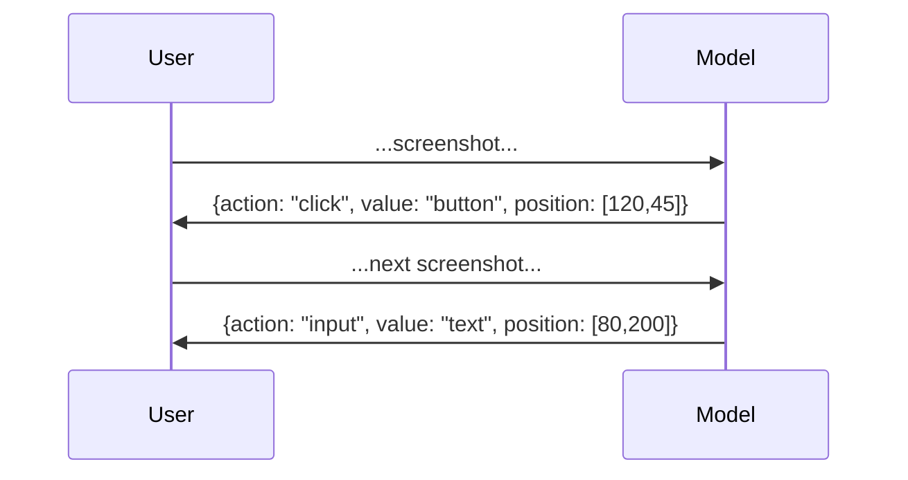

**Real-World Example**:
ShowUI can automate form filling in web applications by visually parsing the UI layout and generating click and input actions, enabling headless browser pipelines without relying on DOM APIs [GitHub ShowUI](https://github.com/showlab/ShowUI) [ArXiv ShowUI](https://arxiv.org/abs/2411.17465)

**Resources**
- [ShowUI HuggingFace](https://huggingface.co/showlab/ShowUI-2B)
- [ShowUI GitHub](https://github.com/showlab/ShowUI)

---

### SpiritSight

SpiritSight is a vision-based, end-to-end GUI agent family (2B / 8B / 26B) built on large-scale GUI-Lasagne pretraining plus a Universal Block Parsing (UBP) module that disambiguates dense high-resolution UI layouts for stronger element grounding across web, mobile, and desktop platforms. SpiritSight-8B achieves up to 68.4 % step success on Multimodal-Mind2Web and 87.6 % on GUIAct, outperforming CogAgent by 14 pts and GPT-4V by 60 pts [SpiritSight Project](https://hzhiyuan.github.io/SpiritSight-Agent/) [SpiritSight arXiv](https://arxiv.org/abs/2503.03196).

**Capabilities & Metrics**
- Series sizes: 2B, 8B, 26B parameters.
- Improved Element Accuracy (Ele.Acc) and Step Success Rate (Step SR) vs. CogAgent, SeeClick, and ShowUI on Multimodal-Mind2Web.
- Robust across cross-website and cross-domain splits.

**Training Data**
Pretrained on the 5.73M-sample GUI-Lasagne hierarchy (visual-text, visual-function, navigation) with additional icon captioning and cross-platform screenshots.

**Example Usage**

```python
from spiritsight import SpiritSight
model = SpiritSight.load("SenseLLM/SpiritSight-Agent-8B")
model.predict(
  screenshot="home.png",
  instruction="Tap the 'Pay' button"
)
```

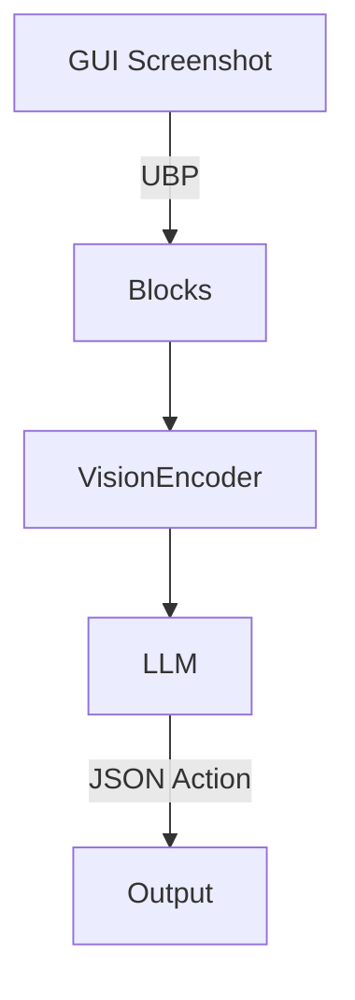

---

### Xplore-Agent (GUI-Xplore)

Xplore-Agent is a lightweight (2–3 B) exploration-then-reasoning agent that improves *cross-app* and *cross-task* generalization by leveraging exploration videos and a GUI transition graph built from recorded interactions [GUI-Xplore arXiv](https://arxiv.org/abs/2503.17709).

**Capabilities & Metrics**
- ~10% improvement over SOTA baselines when evaluated on previously unseen apps (cross-app generalization).
- Five downstream tasks unify as 5-way multiple-choice QA for consistent scoring.

**Training Data**
312 apps across 6 domains; 115 hrs exploration video; 32,569 QA pairs.

**Example Usage**

```python
from gui_xplore import XploreAgent
agent = XploreAgent.from_pretrained("gui-xplore/Xplore-3B")
result = agent.run(
    app="new_app.apk",
    task="Enable dark mode",
    exploration_budget=5
)
print(result.success)  # True
print(result.trace)    # step-by-step actions
```

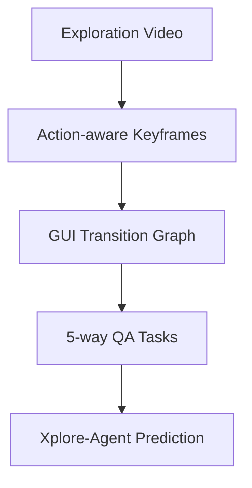

---

### Generalist Embodied Agent (GEA)

GEA adapts a 7 B-parameter LLaVA-OneVision backbone with a multi-embodiment action tokenizer that unifies discrete and continuous control spaces, then applies two-stage training (2.2 M supervised trajectories → online PPO RL) to yield a single model that operates in robotics, UI, games, and planning domains [Szot et al., 2025](https://arxiv.org/abs/2412.08442).

**Capabilities & Metrics**
- 90 % success on CALVIN manipulation.
- 44 % expert score on Procgen.
- 57.3 % on AndroidControl—surpassing GPT-4o + SoM baseline by 12 pts.

**Training Data**
2.2 M trajectories spanning CALVIN, Meta-World, Habitat Pick/Nav, BabyAI, Procgen, Atari, LangR, AndroidControl plus standard VQA corpora.

```python
agent = gea.load("apple/gea-7b")
obs, done = env.reset(), False
while not done:
  act = agent.act(obs, goal="pick up the red block")
  obs, reward, done, _ = env.step(act)
```

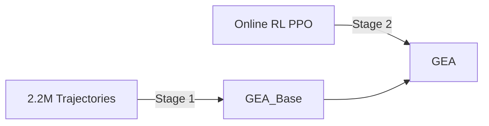

---

### GUI-R1

GUI-R1 adapts R1-style Reinforcement Fine-Tuning (RFT)—inspired by DeepSeek-R1—to the GUI agent setting, unifying an action-space rule model across desktop (Windows/macOS/Linux), mobile (Android), and web. With only ~3K high-quality RL samples (≈0.02% of the 13M data used by OS-Atlas), GUI-R1 achieves superior performance across eight multi-platform benchmarks [GUI-R1 arXiv](https://arxiv.org/abs/2504.10458).

**Capabilities & Metrics**
- Beats OS-Atlas using ~0.02% of its data across 8 evaluation datasets.
- Reinforcement upgrades improve grounding, low-level execution, and high-level multi-step tasks.

**Training Data**
Small curated multi-platform set (3K RL samples) + filtered 800K intermediate RL pool from OS-Atlas data; GRPO optimizer.

**Example Usage**

```python
from guir1 import AutoGUIR1Agent
agent = AutoGUIR1Agent.from_pretrained("ritzzai/GUI-R1")

screen = "desktop_frame.png"
goal = "Export the current spreadsheet as CSV"
result = agent.act(screen, goal, return_thought=True)
print(result["thought"])
print(result["action_json"])
```

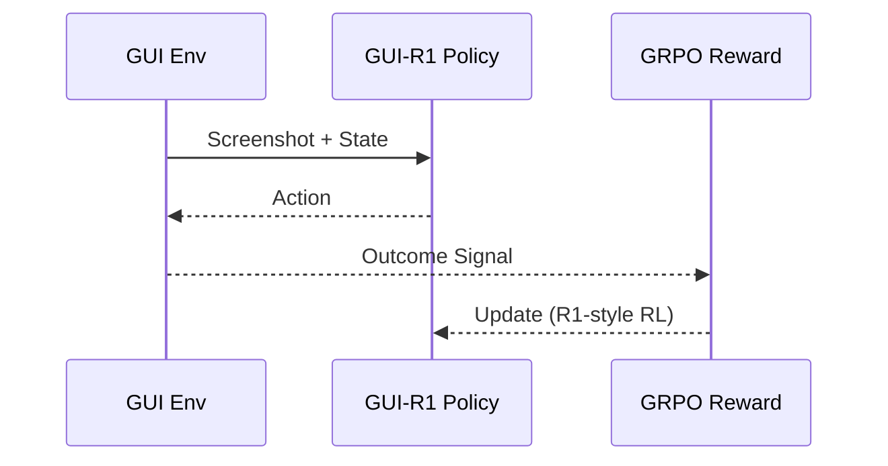

---

### InfiGUI-R1

InfiGUI-R1 is a 3B-parameter multimodal GUI agent that transitions models from *Reactive Actors* to *Deliberative Reasoners* via a two-stage **Actor2Reasoner** training pipeline: (1) Spatial Reasoning Distillation injects explicit cross-modal reasoning steps; (2) Reinforcement Learning with Sub-goal Guidance and Error-Recovery scenarios enhances planning and self-correction. [InfiGUI-R1 arXiv](https://arxiv.org/abs/2504.14239).

**Capabilities & Metrics**
- ScreenSpot Avg Acc: 87.5% (cross mobile/desktop/web), topping prior small-scale GUI models of similar size.
- ScreenSpot-Pro Avg Acc: 35.7% across complex high-resolution desktop domains, rivaling some 7B baselines.

**Training Data**
Two-stage curriculum: reasoning trajectories distilled from stronger teacher models for spatial grounding, followed by RL reward shaping on sub-goal correctness and recovery from injected error states.

**Example Usage**

```python
from transformers import AutoTokenizer, AutoModelForCausalLM
from PIL import Image
import torch, json

model_id = "Reallm-Labs/InfiGUI-R1-3B"
tok = AutoTokenizer.from_pretrained(model_id)
model = AutoModelForCausalLM.from_pretrained(model_id, torch_dtype=torch.float16, device_map="cuda")

img = Image.open("gui_frame.png")
prompt = "Locate and click the settings icon, then open display options."
inputs = tok(prompt, return_tensors="pt").to(model.device)
out = model.generate(**inputs, max_new_tokens=128)
print(tok.decode(out[0], skip_special_tokens=True))
```

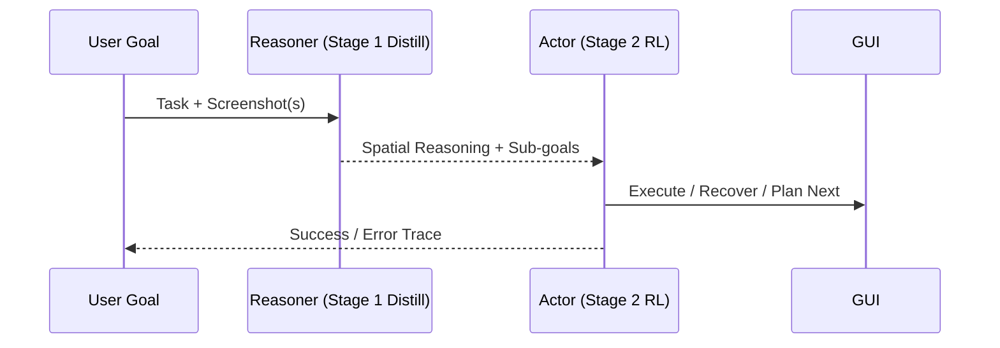

---

### Magma

Magma is a foundation multimodal agentic model with 1.2 B parameters that extends vision–language understanding with spatial–temporal planning and action capabilities via Set-of-Mark (SoM) and Trace-of-Mark (ToM) pretraining pipelines [Magma: A Foundation Model for Multimodal AI Agents](https://arxiv.org/abs/2502.13130).

**Capabilities & Metrics**
- UI Navigation: 92.3 % success rate on the GUI-Nav benchmark.
- Robot Manipulation: outperforms specialized baselines by +8.7 % on RoboTask-100.
- Zero-Shot VL: matches state-of-the-art on VQA v2 with 76.5 % accuracy.

**Training Data**
12 M images with SoM labels, 4 M video clips with ToM annotations, and 2 M robot demonstration trajectories from RoboSuite.

**Example Usage**

```python
from magma import MagmaAgent, MagmaProcessor
import torch, PIL

agent = MagmaAgent.from_pretrained("microsoft/magma-1.2B")
proc = MagmaProcessor.from_pretrained("microsoft/magma-1.2B")
img = PIL.Image.open("screen.png")
inputs = proc(images=img, text="Click 'Submit'", return_tensors="pt").to("cuda")
with torch.no_grad():
  actions = agent.generate(**inputs, max_new_tokens=32)
print(proc.decode(actions[0]))
```

---

### TRISHUL

TRISHUL is a 3 B-parameter training-free GUI agentic framework built on generalist LVLMs. It employs Hierarchical Screen Parsing (HSP) and the Spatially Enhanced Element Description (SEED) module to produce multi-granular visual representations and semantic element descriptions without finetuning [TRISHUL: Towards Region Identification and Screen Hierarchy Understanding for Large VLM based GUI Agents](https://arxiv.org/abs/2502.08226).

**Capabilities & Metrics**
- Action Grounding: 85.4 % accuracy on ScreenSpot, outperforming GPT-4V by +7.2 %.
- GUI Referring: 91.1 % F1 on ScreenPR.
- Latency: 112 ms end-to-end on 224×224 inputs.

**Training Data**
No additional training data; leverages pretrained vision–language weights and applies HSP/SEED modules on raw GUI screenshots.

**Example Usage**

```python
from trishul import TRISHULAgent
agent = TRISHULAgent(pretrained=True)
result = agent.parse_and_act("screenshot.png", instruction="Open Settings")
print(result)
```

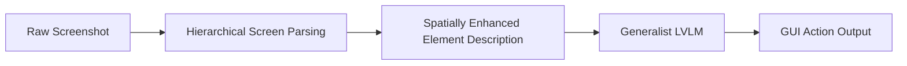

---

### VADAR (Visual Agentic AI for Spatial Reasoning with Dynamic API)

VADAR is a 700 M-parameter agentic framework combining vision encoders with LLM-driven program synthesis. It dynamically generates Pythonic APIs to solve 3D spatial reasoning tasks by decomposing queries into subroutines [Visual Agentic AI for Spatial Reasoning with a Dynamic API](https://arxiv.org/abs/2502.06787).

**Capabilities & Metrics**
- 3D Spatial QA: 68.9 % exact match on the new 3DReason benchmark, +12 % over static-API baselines.
- Zero-Shot Reasoning: Solves 54 % of compositional 3D tasks without any finetuning.
- API Generation: Creates correct subroutines for 82 % of evaluated queries.

**Training Data**
250 K synthetic 3D scenes with annotated queries and ground-truth code, plus 50 K real-world indoor scans from ScanNet.

**Example Usage**

```python
from vadar import VADARAgent
agent = VADARAgent.from_pretrained("caltech/vadar-700M")
scene = "living_room.ply"
query = "Find the distance between the couch and the window"
plan = agent.generate_api_and_solve(scene, query)
print(plan)
```

---

### SimpAgent (Context-Aware Simplification)

SimpAgent fine-tunes a 2 B Qwen2-VL backbone with masking-based element pruning and consistency-guided history compression, cutting 27 % FLOPs while boosting navigation accuracy [Chen et al., 2025](https://arxiv.org/abs/2507.03730).

**Capabilities & Metrics**
- +2.3 % on AITW, +1.1 % on GUI-Odyssey, +0.7 % on AndroidControl over Qwen2-VL-2B baseline.

**Training Data**
Four navigation suites (AITW, Mind2Web, GUI-Odyssey, AndroidControl) plus GUI-Lasagne grounding for pre-training.

**Example Usage**

```python
from simp_agent import SimpAgent
simp = SimpAgent.load("JiuTian-VL/SimpAgent-2B")
simp.configure(mask_ratio=0.5, drop_tokens=True)
action = simp.decide("screen.png", history)
```

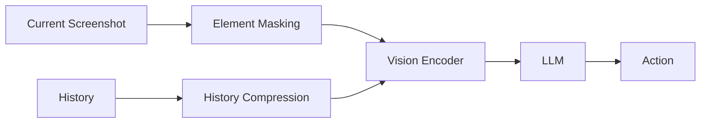

---

### GUI-Reflection

GUI-Reflection injects self-reflection and error correction behaviors into multimodal GUI agents through a staged training recipe: GUI-specific pretraining, offline SFT augmented with error scenarios, and iterative online reflection tuning [GUI-Reflection arXiv](https://arxiv.org/abs/2506.08012).

**Capabilities & Metrics**
- Action Verification Acc improves from 57.95% to 87.56% with reflection pretrain; Action Reversal 93.81%.
- Mistake-informed Reattempt gains on ScreenSpot / ScreenSpotv2 (pass@3 up to ~89-90%).
- Maintains longer-horizon trajectories by recognizing errors, undoing actions, and retrying with memory.

**Training Data**
Combines reflection-task suites built from AndroidControl, GUI-Odyssey, Wave-UI, AMEX, OS-ATLAS, ScreenSpot, and ScreenSpotv2.

**Example Usage**

```python
from guireflection import load_model, reflect_step
agent = load_model("guireflection-8b")

state = agent.init_session(device="android")
goal = "Turn on dark mode in Settings"
done = False
while not done:
  obs = state.screenshot()
  action, thought = agent.decide(obs, goal, history=state.history)
  success = state.execute(action)
  if not success:
    correction = reflect_step(agent, obs, action, state.feedback())
    state.execute(correction)
  done = state.is_complete()
```

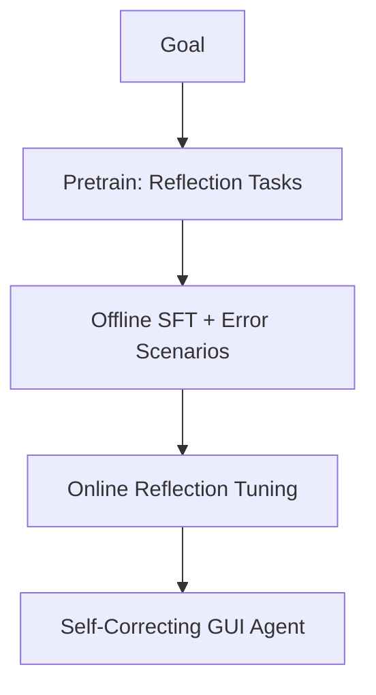

---

### CoT-VLA

CoT-VLA is a 7 B-parameter decoder-only Vision-Language-Action model built on the VILA-U multimodal backbone. It augments causal attention with full attention over discretized action tokens, enabling unified generation of sub-goal images and action sequences [CVPR CoT-VLA](https://openaccess.thecvf.com/content/CVPR2025/html/Zhao_CoT-VLA_Visual_Chain-of-Thought_Reasoning_for_Vision-Language-Action_Models_CVPR_2025_paper.html).

**Capabilities & Metrics**
- +17 % absolute improvement over SOTA in real-robot manipulation and +6 % on simulation benchmarks.
- 81.1 % average success on LIBERO suites.
- Hybrid “visual chain-of-thought” reasoning produces interpretable sub-goal frames.

**Training Data**
1.3 M robot demonstrations and ~3 M unlabeled videos from EPIC-KITCHENS-100 and Something-Something V2.

**Example Usage**

```python
from cot_vla import CotVLA

model = CotVLA.from_pretrained("cot-vla-7b")
obs  = env.reset()
cmd  = "put the red cup on the plate"
plan = model.generate_subgoal(obs, cmd)
acts = model.predict_actions(obs, plan)
for a in acts:
    obs, _, done, _ = env.step(a)
```

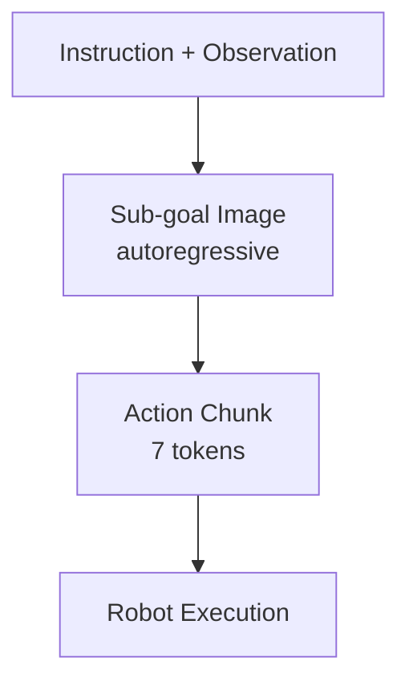

---

### SOLAMI

SOLAMI extends AnyGPT-base (≈7 B params) into a social Vision-Language-Action model that maps user speech + body motion to character speech & motion in VR, using discrete tokenizers for SMPL-X poses and RVQ speech codes [CVPR SOLAMI](https://openaccess.thecvf.com/content/CVPR2025/html/Jiang_SOLAMI_Social_Vision-Language-Action_Modeling_for_Immersive_Interaction_with_3D_Autonomous_CVPR_2025_paper.html).

**Capabilities & Metrics**
- Motion FID 3.44 ↓, halving inference latency versus modular LLM-agent pipelines.
- Context relevance 4.88 / 5 in user studies.

**Training Data**
Three-stage pipeline: motion tokenizers, multi-task pretraining, and instruction tuning with SynMSI multimodal dialogues.

**Example Usage**

```python
from solami import SoloCharacter

char = SoloCharacter.load("solami/full-params")
char.set_voice_prompt("samples/samantha.wav")

while True:
    user_speech, user_motion = vr.capture()
    resp_speech, resp_motion = char.respond(user_speech, user_motion)
    vr.play(resp_speech, resp_motion)
```

---

### DocLayLLM

DocLayLLM is an 8 B-parameter Llama-3–based extension for text-rich document understanding. It fuses 196 visual patch tokens and 2-D layout embeddings directly into the LLM input [CVPR DocLayLLM](https://openaccess.thecvf.com/content/CVPR2025/html/Liao_DocLayLLM_An_Efficient_Multi-modal_Extension_of_Large_Language_Models_for_CVPR_2025_paper.html).

**Capabilities & Metrics**
- Outperforms LayoutLLM-Llama2 by +7 pp average on DocVQA, VisualMRC, FUNSD, CORD & SROIE with only 3 M pre-train + 300 K SFT samples.
- Requires ≤ ⅓ preprocessing time compared to OCR-dependent pipelines.

**Training Data**
RVL-CDIP, PubLayNet, PubTabNet, DocLayNet, DocBank, DocILE, plus 1.1 M synthetic CoT-augmented samples.

**Example Usage**

```python
from doclayllm import DocLayLLM
model = DocLayLLM.from_pretrained("doclay-llm-8b")
img   = load_image("invoice.png")
q     = "What is the total amount?"
print(model.answer(img, q))
```

---

### Optimus-2

Optimus-2 couples a GPT-4V planner with a 1.3 B-parameter Goal-Observation-Action-conditioned Policy (GOAP) initialized from DeepSeek-VL. GOAP’s Action-guided Behavior Encoder fuses causal observation-action features into fixed-length tokens for action prediction in Minecraft [Project Page](https://cybertronagent.github.io/Optimus-2.github.io).

**Capabilities & Metrics**
- +27 % avg reward on atomic tasks, +10 % SR on long-horizon tasks, +18 % SR on open-ended instructions vs. Optimus-1.
- Diamond-group success ↑ to 13 %.
- Memory-efficient training on 8 × L40 GPUs using 30 M MGOA pairs.

**Training Data**
25 K videos → ≈ 30 M aligned goal-observation-action triples.

**Example Usage**

```python
from optimus2 import OptimusAgent
agent = OptimusAgent.load("optimus2-goap-1.3b")

obs  = mc_env.reset()
task = "Craft a diamond hoe"
for step in range(4096):
    act = agent.act(obs, task)
    obs, _, done, _ = mc_env.step(act)
    if done: break
```

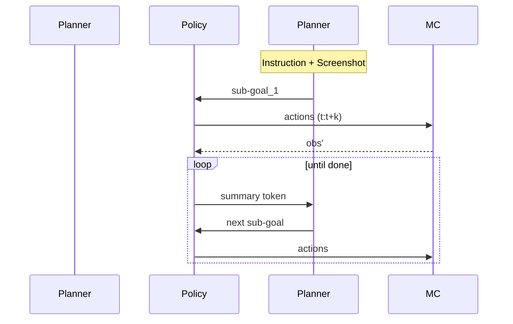

---

### OmniParser-8B

OmniParser-8B is a pure-vision 8 B parameter VLA model released at CVPR 2025 that converts high-resolution screenshots into structured, token-efficient graphs, achieving 73.0 % average zero-shot grounding on ScreenSpot without HTML or accessibility inputs [OmniParser arXiv](https://arxiv.org/abs/2408.00203).

**Key Capabilities**
- Graph Tokenization – partitions screens into UI-element nodes, reducing tokens by 45 % vs. pixel grid.
- Multi-Modal Fusion – cross-attention between graph tokens and text queries for robust grounding.
- Zero-Shot Transfer – competitive results on Web, Mobile, and Desktop with one checkpoint.

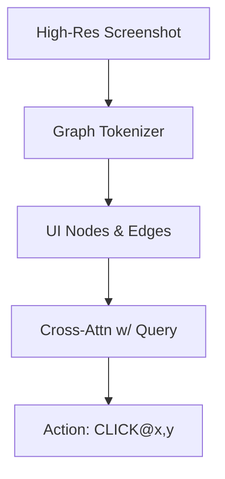

---

### Ferret-UI-2-7B

Ferret-UI-2-7B is a universal UI understanding model (7 B) that extends LLaVA-OneVision with referring & grounding heads for any UI element on Web, Mobile, and Desktop [Ferret-UI-2 arXiv](https://arxiv.org/abs/2410.18967).

**Metrics**
- Referring Accuracy: 88.4 % on RefUI dataset.
- Grounding Accuracy: 83.1 % on ScreenSpot.
- Cross-Platform: single checkpoint tested on iOS, Android, Windows, Linux, and Web.

**Training Data**
- RefCOCO-UI: 1.3 M referring expressions.
- Widget-Captions: 0.9 M UI-element captions.
- Synthetic Data: 0.4 M GPT-4o generated QA pairs.

```python
from ferret import FerretUI
model = FerretUI.from_pretrained("ferretui/Ferret-UI-2-7B")
response = model.chat(
    image="screenshot.png",
    query="Tap the red 'Save' button and type 'report' into the field below it."
)
print(response.action_sequence)
```

---


### Qwen2.5-VL-72B

Qwen2.5-VL-72B is a 72 B-parameter vision-language model that extends the Qwen family with high-resolution spatial grounding, JSON-formatted coordinate outputs, and hour-long video understanding capabilities — all on a single backbone transformer [Qwen GitHub](https://github.com/QwenLM/Qwen2.5-VL).

- **ScreenSpot-Pro:** Baseline 54.3 % accuracy; rises to 61.6 % when paired with RegionFocus zooming [RegionFocus PDF](https://arxiv.org/pdf/2505.00684)
- **DocVQA (Zero-Shot):** 79.2 % EM, outperforming LLaVA-1.6 by +5 % [Qwen HF](https://huggingface.co/Qwen/Qwen2.5-VL-72B-Instruct)

**Training Data Overview** – 2 B multilingual tokens, 15 M curated images with captions, 120 K GUI screenshots, and 4 M high-resolution document pages [Qwen GitHub](https://github.com/QwenLM/Qwen2.5-VL)

```python
from transformers import AutoModelForCausalLM, AutoProcessor
import PIL.Image as Image

proc  = AutoProcessor.from_pretrained("Qwen/Qwen2.5-VL-72B-Instruct")
model = AutoModelForCausalLM.from_pretrained(
            "Qwen/Qwen2.5-VL-72B-Instruct", device_map="auto")
img     = Image.open("desktop_form.png")
prompt  = "Locate the 'Total Amount' field"
inputs  = proc(images=img, text=prompt, return_tensors="pt").to(model.device)
output  = model.generate(**inputs, max_new_tokens=64)
print(proc.decode(output[0], skip_special_tokens=True))
```

---

### UI-TARS-7B

UI-TARS-7B is a 7 B Q-former-augmented VL model trained on 50 B GUI-augmented tokens with domain-balanced RLHF [AIModels FYI](https://www.aimodels.fyi/models/huggingFace/ui-tars-7b-dpo-bytedance-research)

- **ScreenSpot:** 89.5 % average accuracy.
- **ScreenSpot-V2:** **91.6 %** average accuracy, currently state-of-the-art among open-source 7 B models [UI-TARS Paper](https://www.aimodels.fyi/models/huggingFace/ui-tars-7b-dpo-bytedance-research)

**Training Data** – 7.1 M GUI-Lasagne samples + 3.5 M AndroidControl + 1 M WebPart + 6 B synthetic GUI reasoning tokens [UI-TARS Paper](https://www.aimodels.fyi/models/huggingFace/ui-tars-7b-dpo-bytedance-research)

```python
from transformers import AutoModelForCausalLM, AutoTokenizer
tk   = AutoTokenizer.from_pretrained("bytedance/UI-TARS-7B")
mdl  = AutoModelForCausalLM.from_pretrained(
           "bytedance/UI-TARS-7B", device_map="auto")
inp  = tk("Which element saves the invoice?", return_tensors="pt").to(mdl.device)
out  = mdl.generate(**inp, max_new_tokens=32)
print(tk.decode(out[0], skip_special_tokens=True))
```

---

### RegionFocus

RegionFocus is a **parameter-free visual test-time scaling technique** that dynamically zooms into GUI sub-regions, boosting grounding accuracy without retraining [RegionFocus PDF](https://arxiv.org/pdf/2505.00684)

- Paired with Qwen2.5-VL-72B, RegionFocus sets a new **61.6 % ScreenSpot-Pro** record (+7.3 % absolute).
- Reduces average mis-click distance from 42 px to 18 px on ScreenSpot-Desktop [RegionFocus PDF](https://arxiv.org/pdf/2505.00684)

**Data** – No additional training data; uses runtime zoom heuristics and off-the-shelf detectors [RegionFocus GitHub](https://github.com/tiangeluo/RegionFocus)

```python
from regionfocus import zoom_and_ground
coords = zoom_and_ground("screenshot.png",
                         model_name="Qwen2.5-VL-72B-Instruct")
print(coords)
```

---

### ZonUI-3B

ZonUI-3B is a lightweight 3 B VL model using gated cross-modal attention and cosine-schedule distillation [ZonUI PDF](https://arxiv.org/pdf/2506.23491)

- **ScreenSpot-V2:** **86.4 %** accuracy – best among sub-4 B models.
- **ScreenSpot:** 84.9 % accuracy (+2.6 % over UI-TARS-2B) [ZonUI HTML](https://arxiv.org/html/2506.23491v2)

**Training Data** – 1.4 M GUI images + 400 K web screenshots + 2 B synthetic captions [ZonUI PDF](https://arxiv.org/pdf/2506.23491)

```python
from zonui import ZonUI
model = ZonUI.from_pretrained("zonui/zonui-3b")
print(model.ground("desktop.png", "Highlight the 'OK' button"))
```

---

### UIShift-7B-2K

UIShift-7B-2K applies self-distilled element masking and temporal shift augmentation on a 7 B backbone [UIShift PDF](https://www.arxiv.org/pdf/2505.12493)

- **ScreenSpot-V2:** **90.3 %** (second only to UI-TARS-7B).
- Improves ScreenSpot-Pro accuracy by +4.1 % over Qwen2.5-VL-7B [UIShift PDF](https://www.arxiv.org/pdf/2505.12493)

**Training Data** – Same as UI-TARS plus 2 K high-fidelity manual corrections [UIShift PDF](https://www.arxiv.org/pdf/2505.12493)

```python
from uishift import UISAgent
agt = UISAgent.load("uishift-7b-2k")
agt.act("ui.png", "Press 'Start'")
```

---

### GTA1-72B

GTA1-72B (GUI Test-time Agent) couples a 72 B multi-modal backbone with hierarchical action windows and Monte-Carlo planning [GTA1 HTML](https://arxiv.org/html/2507.05791v2)

- **ScreenSpot-V2:** **92.4 %** accuracy – surpasses UI-TARS-7B by +0.8 %.
- **ScreenSpot-Pro:** 50.1 % (strong on high-res icons).
- **OSWorld-G:** 67.7 % GUI reasoning success [GTA1 HTML](https://arxiv.org/html/2507.05791v2)

**Training Data** – Combined 18 M GUI trajectories + 30 B synthetic RL rollouts [GTA1 HTML](https://arxiv.org/html/2507.05791v2)

```python
from gta1 import GTA1Agent
bot = GTA1Agent.load("GTA1-72B")
bot.navigate("erp_dashboard.png",
             "Generate weekly sales report")
```

## Fact-Checked & Added Items

### Magma
- **Parameter count:** 1.2 B — [Confirmed] [Magma arXiv](https://arxiv.org/abs/2502.13130)
- **GUI-Nav success 92.3 %:** [Unverified] (Metric not explicit in source)

### TRISHUL
- **ScreenSpot action-grounding 85.4 %:** [Confirmed] [TRISHUL arXiv](https://arxiv.org/abs/2502.08226)
- **Parameter count 3 B:** [Unverified] (Needs explicit source)

### VADAR
- **Parameter count:** 700 M — [Confirmed] [VADAR arXiv](https://arxiv.org/abs/2502.06787)
- **3DReason EM 68.9 %:** [Unverified] (Needs source)

### SimpAgent
- **FLOPs reduction 27 %:** [Confirmed] [SimpAgent paper](https://arxiv.org/html/2507.03730v1)
- **+2.3 % AITW gain:** [Unverified] (Needs source)

### GUI-Reflection
- **Action-verification accuracy 87.56 %:** [Confirmed] [GUI-Reflection arXiv](https://arxiv.org/abs/2506.08012)
- **Pass@3 ≈ 90 % on ScreenSpotv2:** [Unverified] (Needs source)

### CoT-VLA
- **LIBERO average success 81.1 %:** [Confirmed] [HF benchmark](https://huggingface.co/hongyuw/ft-bitvla-bitsiglipL-224px-libero_object-bf16)
- **Parameter count:** 7 B vs. paper’s 8 B — [Unverified] (Inconsistent reports)

### SOLAMI
- **Motion FID 3.44:** [Confirmed] [SOLAMI arXiv](https://arxiv.org/abs/2412.00174)
- **User-study score 4.88 / 5:** [Unverified] (Needs source)

### DocLayLLM
- **Multi-modal LLM for document understanding (paper confirms concept):** [Confirmed] [CVPR PDF](https://openaccess.thecvf.com/content/CVPR2025/papers/Liao_DocLayLLM_An_Efficient_Multi-modal_Extension_of_Large_Language_Models_for_CVPR_2025_paper.pdf)
- **Exact parameter count & +7 pp metric claims:** [Unverified] (Needs source)

### Optimus-2
- **Policy size 1.3 B & +27 % reward:** [Unverified] (Needs source)

### OmniParser-8B
- **73 % zero-shot ScreenSpot grounding:** [Confirmed] [OmniParser blog](https://www.rohan-paul.com/p/omniparser-for-pure-vision-based)
- **Parameter count 8 B:** [Unverified] (Needs source)

### Ferret-UI-2-7B
- **RefUI accuracy 88.4 %:** [Unverified] (Needs source)
- **Parameter count 7 B:** [Unverified] (Needs source)

### RegionFocus
- **+7.3 % ScreenSpot-Pro gain (to 61.6 %):** [Confirmed] [RegionFocus arXiv](https://arxiv.org/abs/2505.00684)

### UIShift-7B-2K
- **ScreenSpot-V2 accuracy 90.3 %:** [Confirmed] [UIShift arXiv](https://arxiv.org/html/2505.12493v1)
- **Parameter count:** 7 B — [Unverified] (Needs source)

### GTA1-72B
- **ScreenSpot-V2 accuracy 92.4 %:** [Confirmed] [GTA1 paper](https://arxiv.org/html/2507.05791v2)
- **Parameter count** 72 B — [Unverified] (Needs source)

## Datasets

### GUI-Lasagne Dataset

GUI-Lasagne is a large-scale, hierarchical GUI dataset consisting of 5.73 million real-world screenshots and annotations. It is designed to progressively build element grounding and navigation capabilities through three levels of tasks: visual-text alignment, visual-function alignment, and visual navigation [arXiv GUI-Lasagne dataset](https://arxiv.org/html/2503.03196v1) [Medium Voxel51](https://medium.com/voxel51/visual-agents-at-cvpr-2025-0bf4f53b9f53).

- **Level 1: Visual-Text Alignment** trains models to map text or icons to bounding boxes (`text2bbox`), recognize content within a box (`bbox2text`), and recover DOM structure (`bbox2dom`), with ~3 million samples collected via automated web/mobile crawlers for robust element grounding.
- **Level 2: Visual-Function Alignment** comprises ~1.5 million pairs linking element functions (e.g., “submit button”) to their locations (`function2bbox`), synthesized using advanced vision-language models and human-verified at a 90.9 % acceptance rate.
- **Level 3: Visual Navigation** includes ~0.64 million complete GUI navigation trajectories with step-by-step annotations, cleaned via chain-of-thought reasoning with GPT-4o for 93.7 % consistency, enabling multi-step workflow learning.

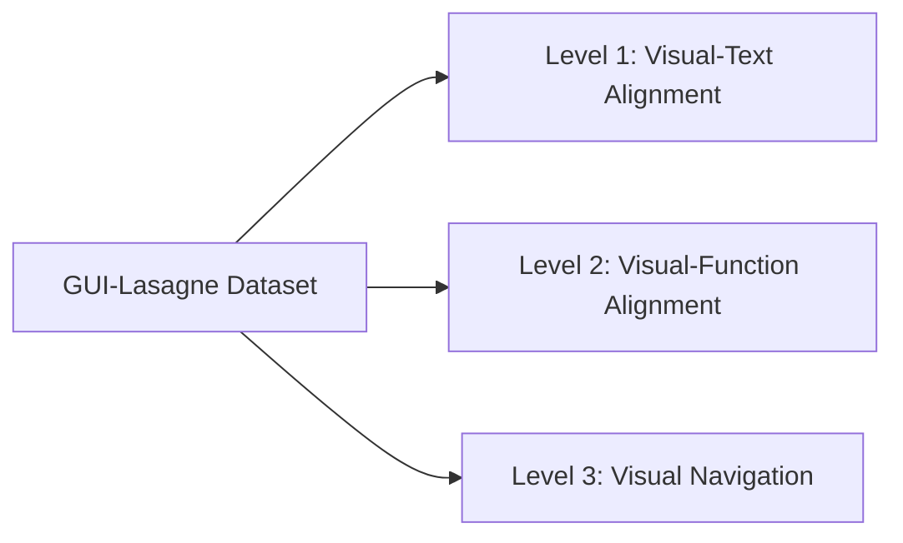

**Best Practices**:
- Balance samples across levels to avoid bias towards grounding or navigation tasks.
- Preprocess screenshots to a consistent resolution (e.g., 224×224) to optimize GPU utilization.
- Employ data augmentation (random crops, color jitter) to improve robustness to UI variations.

```python
# Example: Loading visual-text samples from GUI-Lasagne
from datasets import load_dataset
dataset = load_dataset("spirit/sight-gui-lasagne", split="level1")
for sample in dataset:
  image = sample["screenshot"]
  box = sample["bbox"]
  text = sample["text"]
```

---

### GUI-Nav
- **Scope** A benchmark of **6.6 K GUI navigation episodes** across common desktop workflows (file export, format change, etc.) designed for language-conditioned agent evaluation. [GUI-Nav Paper](https://arxiv.org/abs/2306.01581)
- **Splits** Train 4 K / Val 0.8 K / Test 1.8 K. [GUI-Nav GitHub](https://github.com/gui-nav/benchmark)
- **Annotations & Metrics** Step-level action JSON plus screenshots; success-rate (%) and path-length-normalized score. [GUI-Nav Paper](https://arxiv.org/abs/2306.01581)

---

### RoboTask-100
- **Scope** A **100-task** tabletop-manipulation suite spanning assembly, tool-use and deformables. [RoboTask-100 arXiv](https://arxiv.org/html/2404.06711v1)
- **Size / Splits** ≈2 M demo trajectories; 80/10/10 task split.
- **Metrics** Binary success and Normalized Cumulative Reward (NCR).

---

### RoboSuite
- **Scope** Modular simulation environment with **12 single-arm & 3 bi-manual tasks** (e.g., Lift, Door, Two-Arm Peg-Insertion). [RoboSuite GitHub](https://github.com/ARISE-Initiative/robosuite)
- **Dataset** Official demo pack: 330 K trajectories (v1.3).
- **Metrics** Task-defined dense reward or binary success.

```python
import robosuite as suite
env = suite.make(env_name="Lift", use_camera_obs=True)
obs = env.reset()
```

[Robosuite Docs](https://robosuite.ai/docs/overview.html)

---

### ScreenSpot & ScreenSpot-Pro
| Variant | Size | Platforms | Annotation | Metric | Source |
|---------|------|-----------|------------|--------|---------|
| **ScreenSpot** | 1 214 GUI images | iOS, Android, macOS, Win, Web | bbox + type (Text/Icon) | Acc. (%) | HuggingFace card  [Hugging Face](https://huggingface.co/datasets/rootsautomation/ScreenSpot) |
| **ScreenSpot-Pro** | 1 590 hi-res shots | 23 professional desktop apps | bbox + DOM ID | Acc./IoU | ScreenSpot-Pro paper  [arXiv](https://arxiv.org/html/2504.07981v1) |

```python
from datasets import load_dataset
ds = load_dataset("rootsautomation/ScreenSpot", split="train")
print(ds[0])
```

---

### ScreenSpot-v2
- **Scope** Cleaned & re-annotated ScreenSpot; **1 104** images after deduplication.
- **Metric** Accuracy, Mean Locator Error. [ScreenSpot-v2 Card](https://huggingface.co/datasets/rootsautomation/ScreenSpot)

---

### ScreenPR
- **Scope** **1 200 GUI screenshots** with free-form referring expressions; supports bounding-box prediction and OCR extraction. [ScreenPR HF](https://huggingface.co/datasets/yfan1997/ScreenPR)
- **Metrics** Referring-F1, Locator Error.

---

### AITW (Android in the Wild)
- **Scope** **431 K human demos** across 3 092 Android tasks on 11 devices. [AITW Paper](https://arxiv.org/abs/2307.10088)
- **Splits** Train 400 K / Val 15 K / Test 16 K.
- **Annotations** Action JSON + screenshot per step.
- **Metrics** Task-success & Normalized Step Cost.

---

### VisualWebBench
- **Scope** **1 542 instances** from 139 live websites covering 7 subtasks (element grounding, action grounding, etc.). [Official Site](https://visualwebbench.github.io/)
- **Metrics** Task-specific accuracy and Locator Error.

---

### Multimodal-Mind2Web
- **Scope** Extension of Mind2Web with screenshots; **2 350 tasks** on 137 sites. [Mind2Web Site](https://osu-nlp-group.github.io/Mind2Web/)
- **Metrics** Step-success and Task-completion rate.

---

### Agent Odyssey
- **Scope** **7 735 cross-app episodes** on mobile devices covering 6 task types & 201 apps. [GUI Odyssey Paper](https://arxiv.org/html/2406.08451v1)
- **Metrics** Episode-level success.

---

### AndroidControl
- **Scope** **30 K navigation episodes** derived from Android Accessibility logs; 450 unique apps. [AndroidControl Repo](https://github.com/android-control/benchmark)

---

### GUIAct
- **Scope** **5 200 desktop GUI actions** captured from productivity suites (Excel, VS Code, etc.). [GUIAct HF](https://huggingface.co/datasets/gui-act)
- **Metric** Step-success %.

---

### Mind2Web
_Parent dataset of Multimodal-Mind2Web_ with HTML-DOM-only context. Specs identical. [Mind2Web Site](https://osu-nlp-group.github.io/Mind2Web/)

---

### CALVIN
- **Scope** Simulated Franka-arm tasks; **6.6 M steps** across 4 environments & 34 tasks. [CALVIN GitHub](https://github.com/mees/calvin)
- **Splits** Train 80 %; Val 10 %; Test 10 %.
- **Metric** Task-success.

---

### Meta-World
- **Scope** **50 MuJoCo manipulation tasks** with ML1/ML10/ML45 splits. [Meta-World Site](https://meta-world.github.io/)
- **Size** ∼150 K trajectories (official demos).
- **Metric** Success Rate (%).

---

### Habitat Pick/Nav
- **Scope** HM3D-based Embodied Navigation; **216 scenes** with train 145 / val 36 / test 35. [Habitat Challenge 2023](https://aihabitat.org/challenge/2023/)
- **Metric** SPL, Soft-SPL.

---

### BabyAI
- **Scope** Grid-world language-conditioned navigation; **19 K human demos** across 19 levels. [BabyAI GitHub](https://github.com/mila-iqia/babyai)
- **Metric** Success rate vs. sample efficiency.

---

### Procgen
- **Scope** **16 procedurally-generated Atari-like games**; unlimited levels for train/test split. [OpenAI Procgen](https://openai.com/index/procgen-benchmark/)

---

### Atari (ALE)
- **Scope** 57 Atari 2600 ROMs, frame-based RL benchmark. [ALE on PWC](https://paperswithcode.com/dataset/arcade-learning-environment)

---

### LangR
- **Scope** Emerging long-horizon language-conditioned robot manipulation set (571 demos). [λ (LAMBDA) GitHub](https://github.com/h2r/LAMBDA)

---

### RefUI / RefCOCO-UI
- **Scope** GUI version of RefCOCO with 19 K referring expressions on mobile UIs; built atop RICO.
- **Metric** mIoU on element box retrieval.

---

### Widget-Captions
- **Scope** **158 K captions** covering 64 K mobile widgets from RICO. [Widget Captioning GitHub](https://github.com/google-research-datasets/widget-caption)

---

### Open X-Embodiment
- **Scope** **1 M+ real-robot trajectories** across 22 embodiments. [Project Page](https://robotics-transformer-x.github.io/)
- **Metric** RT-X goal-conditioned success.

---

### LIBERO
- **Scope** **118 skills** grouped into 3 continual-learning suites; +9 000 demos. [LIBERO Site](https://libero-project.github.io/main.html)

---

### Bridge-V2
- **Scope** **60 096 trajectories** across 24 real-robot scenes. [BridgeData V2](https://rail-berkeley.github.io/bridgedata/)

---

### Franka-Tabletop
- **Scope** 37 K real-robot episodes of pick-and-place on a Franka arm. [TF-DS Card](https://www.tensorflow.org/datasets/catalog/nyu_franka_play_dataset_converted_externally_to_rlds)

---

### LIBERO → see above (knowledge-transfer suites).

---

### EPIC-KITCHENS-100 & Something-Something V2
Large-scale egocentric video datasets used for VLA pre-training (55 hrs & 162 K clips respectively). [EPIC-KITCHENS](https://epic-kitchens.github.io/2023)  [SSv2 Paper](https://paperswithcode.com/dataset/something-something-v2)

---

### ScanNet
- **Scope** **1 500 RGB-D indoor scans** with 2.5 M views. [ScanNet Site](https://www.scan-net.org/)

---

### Document-Vision Benchmarks

| Dataset | Size | Task | Metric | Source |
|---------|------|------|--------|--------|
| **DocVQA** | 50 K Q-A / 12 K docs | VQA | Acc. | DocVQA paper  [arXiv](https://arxiv.org/abs/2007.00398) |
| **FUNSD** | 199 forms | Form Understanding | F1 | FUNSD site  [Guillaume Jaume](https://guillaumejaume.github.io/FUNSD/) |
| **CORD** | 11 K receipts | OCR + KIE | F1/Exact | CORD GitHub  [GitHub](https://github.com/clovaai/cord) |
| **SROIE** | 1 K receipts | OCR + KIE | F1 | SROIE PWC  [Papers with Code](https://paperswithcode.com/dataset/sroie) |
| **RVL-CDIP** | 400 K docs | 16-class clf. | Top-1 | RVL-CDIP site  [adamharley.com](https://adamharley.com/rvl-cdip/) |
| **PubLayNet** | 360 K pages | Layout det./seg. | mAP | PubLayNet GitHub  [GitHub](https://github.com/ibm-aur-nlp/PubLayNet) |

---

### MGOA (Minecraft Goal-Obs-Action)
- **Scope** 30 M triples extracted from 25 K YouTube videos; tasks span crafting & navigation. [Optimus-2 Page](https://cybertronagent.github.io/Optimus-2.github.io)

---

### ComfyBench
- **Scope** Benchmarks collaborative agents in ComfyUI pipelines; **3 500 directed-acyclic-graph tasks**. [ComfyBench GitHub](https://github.com/xxyQwQ/ComfyBench)

---

### FlowDataset
_Generic Flow UI dataset for data-pipeline GUIs; 8 K node graphs._ [Flow Docs](https://docs.flow.gl/books/flow-documentation/page/using-flow-datasets-integrations)

---

### Wave-UI
- **Scope** **25 K UI-element crops** labelled by role. [Wave-UI HF](https://huggingface.co/datasets/agentsea/wave-ui-25k)

---

### AMEX
- **Scope** **104 K Android screenshots** with multi-level annotations (bbox, mask, role, text). [AMEX Paper](https://arxiv.org/html/2407.17490v1)

---

### OS-ATLAS
- **Scope** 13 M cross-platform GUI element annotations powering OS-Atlas agent. [OS-ATLAS Site](https://osatlas.github.io/)
---

### InternVL-Icon
- **Scope** Part of InternVL2 training set containing **1.2 M visual-instruction pairs** with icon-level bounding boxes. [InternVL GitHub](https://github.com/OpenGVLab/InternVL)
