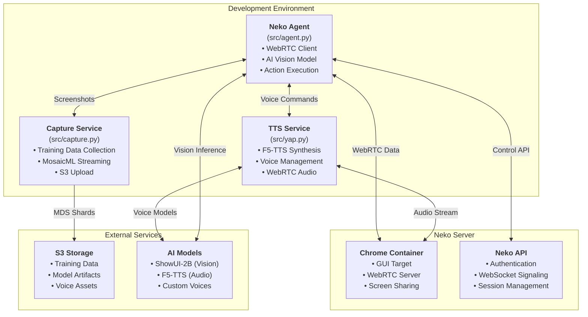
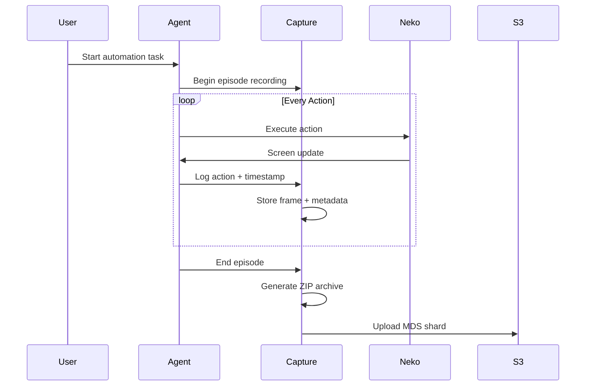
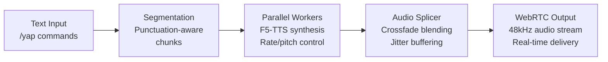

# Architecture Overview

This document provides a comprehensive overview of the Neko Agent system architecture, covering the core components, data flow, and integration patterns.

## System Overview



## Core Components

### 1. Neko Agent (`src/agent.py`)

The main automation agent that orchestrates GUI interactions through AI-powered decision making.

**Key Features:**
- **WebRTC Integration**: Real-time connection to Neko Chrome containers
- **AI Vision**: ShowUI-2B (Qwen2VL) model for visual reasoning and action planning
- **Action Execution**: Supports CLICK, INPUT, SCROLL, SWIPE, TAP, ANSWER actions
- **Prometheus Metrics**: Built-in observability and performance monitoring

**Architecture:**
```python
class NekoAgent:
    def __init__(self):
        self.model = ShowUI2B()
        self.webrtc = WebRTCClient()
        self.metrics = PrometheusMetrics()
    
    async def run(self, task: str):
        # 1. Connect to Neko via WebRTC
        await self.webrtc.connect()
        
        # 2. Capture current screen
        frame = await self.webrtc.get_frame()
        
        # 3. AI model analyzes screen and plans action
        action = await self.model.analyze(frame, task)
        
        # 4. Execute action through WebRTC
        await self.webrtc.execute_action(action)
        
        # 5. Repeat until task complete
```

### 2. Capture Service (`src/capture.py`)

Automated training data collection system that records agent sessions for model improvement.

**Key Features:**
- **Episode Recording**: Packages complete automation sessions as training samples
- **MosaicML Streaming**: Generates MDS shards for efficient distributed training
- **S3 Integration**: Direct upload to cloud storage with configurable backends
- **WebSocket Monitoring**: Real-time capture of agent actions and screen states

**Data Flow:**


### 3. TTS Service (`src/yap.py`)

Real-time text-to-speech system providing voice feedback during automation.

**Key Features:**
- **F5-TTS Integration**: High-quality voice synthesis with custom voice models
- **WebRTC Audio**: Direct audio streaming to Neko sessions
- **Voice Management**: Hot-reloadable voice registry with style parameters
- **Streaming Support**: Both immediate and incremental text processing

**Audio Pipeline:**


## Data Flow and Integration

### WebRTC Communication

The system uses WebRTC for low-latency communication with Neko containers:

```python
# WebRTC connection establishment
async def connect_to_neko():
    # 1. REST API authentication
    token = await authenticate(neko_url, username, password)
    
    # 2. WebSocket signaling
    ws_url = f"wss://{host}/api/ws?token={token}"
    signaling = await websockets.connect(ws_url)
    
    # 3. WebRTC peer connection
    pc = RTCPeerConnection()
    
    # 4. Add video track (for screen capture)
    @pc.on("track")
    async def on_track(track):
        if track.kind == "video":
            frame = await track.recv()
            # Process frame for AI analysis
    
    # 5. Exchange SDP offer/answer
    await exchange_sdp(pc, signaling)
```

### Training Data Format

The capture service generates training samples in this format:

```text
episode_xyz789.zip
├── meta.json              # Episode metadata
├── frames/                # Screenshot sequence
│   ├── 000000.jpg         #   Frame 0 (t=0.0s)
│   ├── 000001.jpg         #   Frame 1 (t=0.5s)
│   └── ...
├── frames.ndjson          # Frame index with timestamps
└── actions.ndjson         # Action sequence with timestamps
```

**MDS Shard Structure:**
```python
# MosaicML Streaming format
columns = {
    "episode_id": "str",
    "task": "str", 
    "payload": "bytes",      # ZIP archive
    "num_frames": "int",
    "num_actions": "int",
    "started_at": "str",
    "ended_at": "str",
    "screen_w": "int",
    "screen_h": "int"
}
```

### Voice Model Management

The TTS service manages voices through a JSON registry:

```json
{
  "instructor": {
    "ref_audio": "/voices/instructor.wav",
    "ref_text": "This is an instructional voice for tutorials",
    "styles": ["calm", "explanatory"],
    "params": {
      "rate": 0.95,
      "pitch": -1.0
    }
  }
}
```

## Deployment Patterns

### Development Mode

```bash
# Terminal 1: Neko server
nix develop .#neko
neko-services up

# Terminal 2: Agent
nix develop .#gpu  
uv run src/agent.py --task "automation task"

# Terminal 3: Capture (optional)
uv run src/capture.py

# Terminal 4: TTS (optional)
uv run src/yap.py
```

### Production Considerations

For production deployments, consider:

1. **Container Orchestration**: Deploy components as separate containers
2. **GPU Resource Management**: Efficient sharing between agent and TTS
3. **Storage Strategy**: S3-compatible backends for training data
4. **Monitoring**: Prometheus metrics and health checks
5. **Scaling**: Multiple agent instances with load balancing

See the [API Mode Design](../future/api-mode-design.md) for detailed production architecture plans.

## Error Handling and Resilience

### Connection Resilience

```python
# Exponential backoff for WebRTC reconnection
async def connect_with_retry():
    backoff = 1.0
    max_retries = 5
    
    for attempt in range(max_retries):
        try:
            return await establish_webrtc_connection()
        except ConnectionError:
            await asyncio.sleep(backoff)
            backoff = min(30.0, backoff * 2)
    
    raise MaxRetriesExceeded()
```

### Graceful Degradation

- **Capture failures**: Agent continues without training data collection
- **TTS unavailable**: Silent operation mode
- **Model errors**: Fallback to basic automation patterns
- **Network issues**: Local caching and offline capabilities

## Performance Characteristics

### Latency Profile

- **Frame processing**: ~100-200ms (GPU inference)
- **Action execution**: ~50-100ms (WebRTC round-trip)
- **Voice synthesis**: ~200-500ms (F5-TTS generation)
- **Training data write**: ~10-50ms (local storage)

### Resource Usage

- **GPU Memory**: 2-4GB (ShowUI-2B + F5-TTS)
- **System Memory**: 1-2GB (Python runtime + buffers)
- **Network**: 5-10 Mbps (WebRTC video + audio)
- **Storage**: Variable (training data accumulation)

## Security Considerations

### Authentication

- JWT tokens for Neko API access
- WebSocket secure connections (WSS)
- S3 IAM roles for training data upload

### Data Privacy

- Local frame processing (no external API calls)
- Configurable training data retention
- Optional data encryption at rest

### Network Security

- TLS/SSL for all external connections
- WebRTC DTLS encryption
- Firewall-friendly STUN/TURN protocols

## Future Architecture Evolution

The current architecture is designed to support future enhancements:

1. **API Mode**: RESTful service with horizontal scaling
2. **Multi-Modal**: Vision + audio + text understanding
3. **Distributed Training**: Cloud-native ML pipelines
4. **Edge Deployment**: Lightweight inference containers

See [API Mode Design](../future/api-mode-design.md) for the complete next-generation architecture.