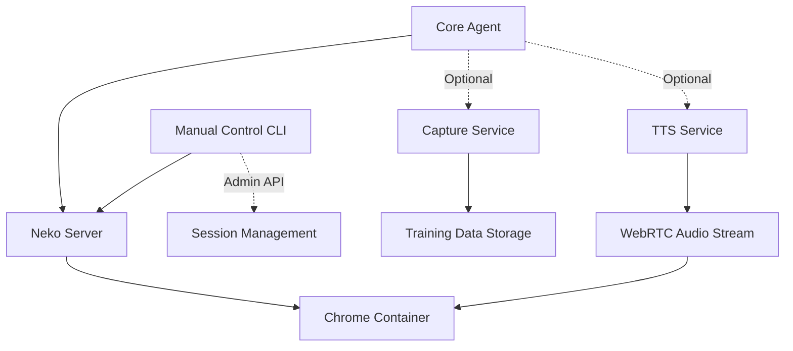

# Component Documentation

This section provides detailed documentation for each component of the Neko Agent system.

## Overview

The Neko Agent system consists of four main components:

1. **[Core Agent](./components/agent.md)** (`src/agent.py`) - Main automation engine
2. **[Capture Service](./components/capture.md)** (`src/capture.py`) - Training data collection
3. **[Manual Control CLI](./components/manual.md)** (`src/manual.py`) - Interactive remote control interface
4. **[TTS Service](./components/yap.md)** (`src/yap.py`) - Voice synthesis and audio

Each component is designed to work independently while providing seamless integration when used together.

## Component Interaction

## Development Workflow

When developing with multiple components:

1. **Start Neko Server** (if using local setup)
2. **Launch Core Agent** for basic automation
3. **Add Capture Service** for training data collection
4. **Use Manual Control CLI** for testing and debugging
5. **Add TTS Service** for voice feedback

Each component has its own configuration and can be enabled/disabled as needed.

## Next Steps

- Review individual component documentation in the subsections
- See [Development Setup](./development.md) for configuration details
- Check [Architecture Overview](./architecture.md) for system design