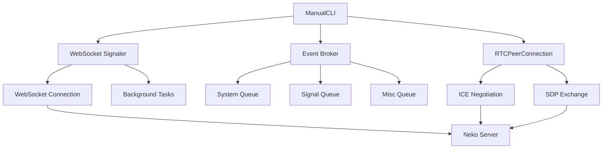
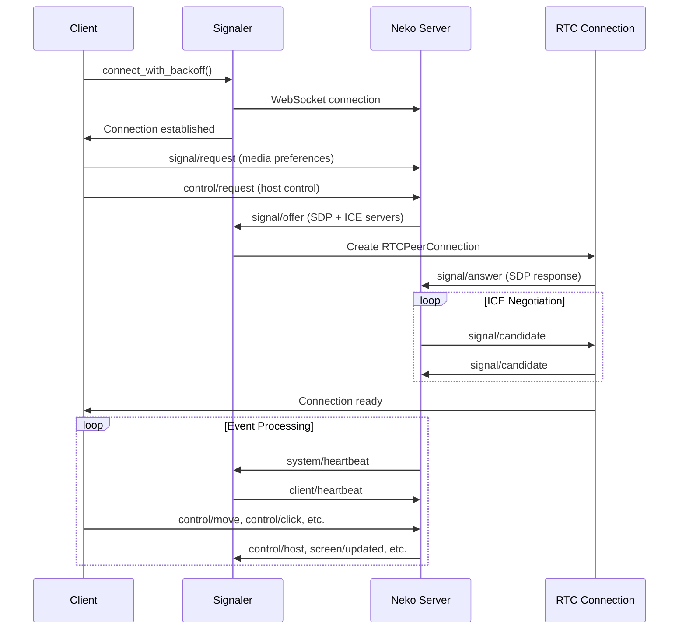

# Manual Control CLI

The Manual Control CLI (`src/manual.py`) provides a production-ready command-line interface for manually interacting with Neko v3 servers. This tool implements the complete WebRTC signaling handshake required by modern Neko servers and offers a comprehensive REPL for remote desktop control.

## Overview

The Manual CLI is designed for:
- **Manual testing** of Neko server functionality
- **Remote administration** tasks on hosted desktops
- **Development and debugging** of Neko integrations
- **Quality assurance** testing of desktop applications

### Key Features

- **Full WebRTC Signaling**: Complete SDP/ICE handshake for control acceptance
- **Robust Authentication**: REST login with automatic token management
- **Auto-reconnection**: Intelligent reconnection with exponential backoff
- **REPL Interface**: Interactive command-line with comprehensive controls
- **Multiple Input Methods**: Mouse, keyboard, scrolling, and gesture support
- **Admin Commands**: Session management and force control operations
- **Coordinate Systems**: Support for both pixel and normalized (0..1) coordinates

## Architecture

### Core Components



### Class Hierarchy

1. **`Broker`** - Event routing and message distribution
2. **`Signaler`** - WebSocket connection management
3. **`ManualCLI`** - Main application controller and REPL

## Usage

### Basic Connection

```bash
# Direct WebSocket connection
python manual.py --ws "wss://neko.example.com/api/ws?token=abc123"

# REST authentication
python manual.py --neko-url "https://neko.example.com" \
                 --username "admin" --password "password"
```

### Configuration Options

| Flag | Environment | Description |
|------|-------------|-------------|
| `--ws` | `NEKO_WS` | Direct WebSocket URL with token |
| `--neko-url` | `NEKO_URL` | Base URL for REST authentication |
| `--username` | `NEKO_USER` | Login username |
| `--password` | `NEKO_PASS` | Login password |
| `--size` | `NEKO_SIZE` | Virtual screen size (e.g., "1920x1080") |
| `--norm` | - | Use normalized 0..1 coordinates |
| `--no-auto-host` | - | Disable automatic host control requests |
| `--no-media` | - | Skip WebRTC signaling (may break control) |
| `--no-audio` | - | Disable audio streaming |

### Environment Variables

```bash
# Logging configuration
export NEKO_LOGLEVEL=DEBUG
export NEKO_LOGFILE=/tmp/neko-manual.log

# Connection parameters
export NEKO_URL=https://neko.example.com
export NEKO_USER=admin
export NEKO_PASS=secretpassword
export NEKO_SIZE=1920x1080
```

## REPL Commands

### Navigation and Control

#### Mouse Operations
```text
move X Y                    # Move cursor to coordinates
click [button]              # Click at current position (left/right/middle)
lclick                      # Left click shortcut
rclick                      # Right click shortcut
dblclick                    # Double click with proper timing
hover X Y                   # Move to coordinates without clicking
tap X Y [button]            # Move and click in one command
swipe x1 y1 x2 y2          # Drag gesture between two points
```

#### Keyboard Input
```text
key <KeyName>               # Press a specific key (Escape, F5, Control, etc.)
text "some text"            # Type text at current cursor focus
input X Y "text"            # Click at coordinates and type text
enter                       # Press Enter/Return key
```

#### Scrolling
```text
scroll <direction> [amount] # Scroll up/down/left/right (amount defaults to 1)
```

#### Clipboard Operations
```text
copy                        # Send copy command
cut                         # Send cut command
select_all                  # Select all content
paste [text]                # Paste clipboard or specific text
```

### Connection Management

```text
host                        # Request host control
unhost                      # Release host control
size [WxH]                  # Show or set virtual screen size
raw '{"event":"...","payload":{}}' # Send raw JSON message
```

### Administrative Commands

```text
force-take                  # Force take host control (admin only)
force-release               # Force release host control (admin only)
kick <sessionId>            # Force disconnect a session (admin only)
sessions                    # List all connected users and session IDs
```

### Utility Commands

```text
help                        # Show command reference
quit / exit                 # Close connection and exit
```

## API Reference

### Core Classes

#### `Broker`

Event routing system that distributes incoming WebSocket messages to appropriate topic queues.

```python
class Broker:
    def __init__(self)
    def topic_queue(self, topic: str, maxsize: int = 512) -> asyncio.Queue
    def publish(self, msg: Dict[str, Any]) -> None
```

**Topic Routing:**
- `signal/` events → `signal` queue (WebRTC signaling)
- `system/`, `control/`, `screen/`, `keyboard/`, `session/`, `error/` → `system` queue
- All others → `misc` queue

#### `Signaler`

WebSocket connection manager with automatic reconnection and background message processing.

```python
class Signaler:
    def __init__(self, url: str, **wsopts)
    async def connect_with_backoff(self) -> "Signaler"
    async def close(self) -> None
    async def send(self, msg: Dict[str, Any]) -> None
```

**Key Features:**
- Exponential backoff reconnection (1s → 30s max)
- Separate read/write loops for optimal performance
- Graceful shutdown with task cleanup
- Message queuing during disconnection

#### `ManualCLI`

Main application controller that orchestrates connection management, WebRTC signaling, and user interaction.

```python
class ManualCLI:
    def __init__(self, ws: str, width: int, height: int,
                 normalized: bool, auto_host: bool,
                 request_media: bool, base_url: Optional[str] = None,
                 token: Optional[str] = None, audio: bool = True)
    async def start(self) -> None
    async def handle(self, line: str) -> None
```

### Utility Functions

#### `parse_size(s: str) -> Tuple[int, int]`

Parse screen size string (e.g., "1920x1080") into width/height tuple.

#### `ws_from_rest_login(neko_url: str, username: str, password: str, *, timeout: float = 10.0) -> Tuple[str, str, str]`

Perform REST authentication and derive WebSocket URL with token.

#### `name_keysym(name: str) -> int`

Map key names to X11 keysym codes for keyboard events.

## Protocol Implementation

### WebRTC Signaling Flow

1. **Initial Request**: Send `signal/request` with video/audio preferences
2. **Offer Reception**: Wait for `signal/offer` or `signal/provide` from server
3. **ICE Configuration**: Parse and validate ICE servers (strict mapping)
4. **SDP Exchange**: Set remote description, create answer, send local description
5. **ICE Candidates**: Process incoming candidates and send local candidates
6. **Media Handling**: Log received tracks without processing (control-only)

### Connection Lifecycle



### Error Handling and Reconnection

The CLI implements robust error handling:

- **WebSocket Errors**: Automatic reconnection with exponential backoff
- **Authentication Failures**: Clear error messages and exit
- **Protocol Errors**: Graceful degradation and retry
- **Resource Cleanup**: Proper task cancellation and connection shutdown

## Integration Examples

### Basic Automation Script

```python
import asyncio
from manual import ManualCLI, ws_from_rest_login

async def automate_task():
    # Get WebSocket URL via REST login
    ws_url, base_url, token = ws_from_rest_login(
        "https://neko.example.com",
        "admin",
        "password"
    )

    # Create CLI instance
    cli = ManualCLI(
        ws=ws_url,
        width=1920,
        height=1080,
        normalized=False,
        auto_host=True,
        request_media=True,
        base_url=base_url,
        token=token
    )

    # Start connection and wait for ready
    await cli.start()

    # Perform automation tasks
    await cli.handle("move 100 100")
    await cli.handle("click")
    await cli.handle("text 'Hello World'")
    await cli.handle("key Enter")

if __name__ == "__main__":
    asyncio.run(automate_task())
```

### Custom Event Handler

```python
class CustomCLI(ManualCLI):
    async def _event_logger(self):
        """Override event logger with custom handling."""
        q = self.signaler.broker.topic_queue("system")

        while self.running and self.signaler and not self.signaler._closed.is_set():
            try:
                msg = await q.get()
                ev = msg.get("event", "")
                payload = msg.get("payload", {})

                # Custom event processing
                if ev == "control/host":
                    print(f"Host control changed: {payload}")
                elif ev == "session/created":
                    print(f"New session: {payload}")

                # Call parent handler
                await super()._event_logger()

            except asyncio.CancelledError:
                break
```

## Security Considerations

### Authentication
- Always use HTTPS/WSS in production
- Store credentials securely (environment variables, not code)
- Implement proper token rotation for long-running sessions

### Network Security
- Validate SSL certificates in production
- Use VPN or private networks for sensitive operations
- Monitor connection logs for suspicious activity

### Access Control
- Limit admin command usage to authorized users
- Implement session timeouts for inactive connections
- Log all control operations for audit trails

## Troubleshooting

### Common Issues

#### Connection Failures
```bash
# Enable debug logging
export NEKO_LOGLEVEL=DEBUG
export NEKO_LOGFILE=/tmp/debug.log

# Check WebSocket connectivity
python manual.py --ws "wss://neko.example.com/api/ws?token=test"
```

#### Authentication Errors
```bash
# Verify REST API access
curl -X POST https://neko.example.com/api/login \
     -H "Content-Type: application/json" \
     -d '{"username":"admin","password":"password"}'
```

#### WebRTC Issues
- **ICE Failures**: Check firewall and NAT configuration
- **SDP Errors**: Verify codec compatibility
- **Media Problems**: Use `--no-audio` flag for control-only mode

#### Performance Issues
- **High Latency**: Check network connectivity and server load
- **Dropped Connections**: Reduce `ping_interval` in WebSocket options
- **Memory Leaks**: Monitor task cleanup during reconnection

### Debug Commands

```python
# Raw protocol inspection
await cli.handle('raw \'{"event":"system/stats"}\'')

# Connection diagnostics
await cli.handle('raw \'{"event":"signal/stats"}\'')

# Session information
await cli.handle('sessions')
```

## Development

### Testing

```bash
# Unit tests
python -m pytest tests/test_manual.py

# Integration tests with local Neko server
docker-compose up neko
python manual.py --neko-url http://localhost:8080 --username admin --password neko

# Load testing
python scripts/stress_test_manual.py --connections 10 --duration 300
```

### Contributing

When modifying `manual.py`:

1. **Maintain Protocol Compatibility**: Don't break existing WebRTC signaling
2. **Add Comprehensive Tests**: Cover new REPL commands and edge cases
3. **Update Documentation**: Keep this guide and docstrings current
4. **Follow PEP Standards**: Code must comply with PEP 257/287 for docstrings
5. **Handle Errors Gracefully**: All new features must have proper error handling

### Extending Functionality

#### Adding New Commands

```python
# In ManualCLI.handle() method
if cmd == "my_command":
    await self._handle_my_command(rest)
    return

# Implement handler method
async def _handle_my_command(self, args) -> None:
    """Handle the 'my_command' REPL command.

    :param args: Command arguments from user input
    :type args: list
    """
    if not args:
        print("usage: my_command <parameter>")
        return

    # Command implementation
    await self._safe_send({
        "event": "custom/my_event",
        "payload": {"param": args[0]}
    })
```

#### Custom Event Processing

```python
# In _event_logger() method
elif ev == "custom/my_event":
    self._handle_custom_event(payload)

def _handle_custom_event(self, payload: dict) -> None:
    """Process custom server events.

    :param payload: Event payload from server
    :type payload: dict
    """
    # Custom event handling logic
    pass
```

This documentation provides comprehensive coverage of the Manual Control CLI, from basic usage to advanced development scenarios. The tool serves as both a practical utility for Neko server interaction and a reference implementation for WebRTC signaling protocols.
