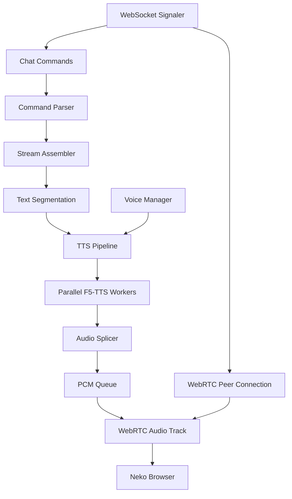

# TTS Service (yap.py)

The YAP (Yet Another Presenter) service provides real-time text-to-speech functionality through WebRTC audio streaming. It connects to Neko servers and responds to chat commands for immediate or streaming speech synthesis.

## Overview

YAP transforms text messages into high-quality speech using F5-TTS and broadcasts the audio through WebRTC. It supports both immediate synthesis and streaming mode for real-time conversation scenarios.

### Key Features

- **Real-time TTS**: Low-latency speech synthesis using F5-TTS
- **WebRTC Integration**: Direct audio streaming to Neko browser sessions
- **Voice Management**: Hot-reloadable voice configurations with custom parameters
- **Streaming Mode**: Incremental text processing for live conversations
- **Chat Commands**: Interactive control through Neko chat interface
- **Parallel Processing**: Multi-threaded TTS workers for improved performance
- **Audio Pipeline**: Crossfade splicing and jitter buffering for smooth playback

## Architecture



## Installation

### Dependencies

```bash
# Core dependencies
pip install aiortc av websockets numpy

# F5-TTS (required for speech synthesis)
pip install git+https://github.com/SWivid/F5-TTS.git

# Optional resampling backends (first available will be used)
pip install torchaudio  # Preferred
# OR
pip install scipy      # Alternative
# Linear fallback is built-in
```

### System Requirements

- Python 3.8+
- CUDA-capable GPU (recommended for F5-TTS)
- WebRTC-compatible environment

## Configuration

YAP follows 12-factor app principles with environment-based configuration:

### Connection Settings

| Variable | Default | Description |
|----------|---------|-------------|
| `YAP_WS` / `NEKO_WS` | - | Direct WebSocket URL |
| `NEKO_URL` | - | REST API base URL |
| `NEKO_USER` | - | Username for REST authentication |
| `NEKO_PASS` | - | Password for REST authentication |

### Audio Settings

| Variable | Default | Description |
|----------|---------|-------------|
| `YAP_SR` | 48000 | Output sample rate (Hz) |
| `YAP_AUDIO_CHANNELS` | 1 | Audio channels (1=mono, 2=stereo) |
| `YAP_FRAME_MS` | 20 | WebRTC frame size (10/20/30/40/60ms) |
| `YAP_JITTER_MAX_SEC` | 6.0 | PCM buffer maximum duration |

### TTS Pipeline Settings

| Variable | Default | Description |
|----------|---------|-------------|
| `YAP_PARALLEL` | 2 | Parallel TTS worker threads |
| `YAP_CHUNK_TARGET_SEC` | 3.0 | Target chunk duration hint |
| `YAP_MAX_CHARS` | 350 | Maximum characters per chunk |
| `YAP_OVERLAP_MS` | 30 | Audio crossfade overlap |

### Voice Settings

| Variable | Default | Description |
|----------|---------|-------------|
| `YAP_VOICES_DIR` | ./voices | Voice configuration directory |
| `YAP_SPK_DEFAULT` | default | Default speaker ID |

### Logging & ICE Settings

| Variable | Default | Description |
|----------|---------|-------------|
| `YAP_LOGLEVEL` | INFO | Log level (DEBUG/INFO/WARNING/ERROR) |
| `YAP_LOG_FORMAT` | text | Log format (text/json) |
| `YAP_STUN_URL` | stun:stun.l.google.com:19302 | STUN server |
| `YAP_ICE_POLICY` | strict | ICE server policy (strict/all) |

## Usage

### Basic Usage

```bash
# Direct WebSocket connection
export YAP_WS="wss://demo.neko.com/api/ws?token=your_token"
python src/yap.py

# REST API authentication
export NEKO_URL="https://demo.neko.com"
export NEKO_USER="username"
export NEKO_PASS="password"
python src/yap.py
```

### Command Line Options

```bash
python src/yap.py --help

# Common options
python src/yap.py \
  --ws "wss://host/api/ws?token=..." \
  --sr 48000 \
  --channels 1 \
  --parallel 4 \
  --loglevel DEBUG
```

### Health Check

```bash
# Validate configuration
python src/yap.py --healthcheck
```

## Chat Commands

YAP responds to commands in Neko chat:

### Immediate Speech

```text
/yap Hello, this is immediate speech synthesis!
```

### Streaming Mode

```text
/yap:begin
This text will be processed incrementally...
More text gets added and synthesized in chunks...
/yap:end
```

### Voice Control

```bash
# Switch active voice and parameters
/yap:voice set --spk alice --rate 1.2 --pitch 0.5

# Add new voice
/yap:voice add --spk bob --ref /path/to/reference.wav --ref-text "Reference text" --styles "calm,friendly"

# Reload voice configurations
/yap:voice reload
```

### Queue Management

```text
# Stop current synthesis and clear queue
/yap:stop
```

## Voice Management

### Voice Configuration (`voices.json`)

```json
{
  "default": {
    "ref_audio": "./voices/default.wav",
    "ref_text": "This is a default reference recording.",
    "styles": ["calm", "neutral"],
    "params": {
      "rate": 1.0,
      "pitch": 0.0
    }
  },
  "alice": {
    "ref_audio": "./voices/alice_sample.wav",
    "ref_text": "Hello, I'm Alice and this is my voice.",
    "styles": ["friendly", "energetic"],
    "params": {
      "rate": 1.1,
      "pitch": 0.2
    }
  }
}
```

### Voice Parameters

- **rate**: Speech speed multiplier (0.5-2.0)
- **pitch**: Pitch shift in semitones (-12 to +12)
- **styles**: Descriptive tags for voice characteristics
- **ref_audio**: Path to reference audio file (WAV format)
- **ref_text**: Transcript of reference audio

### Hot Reloading

Voice configurations can be updated without restarting:

1. Edit `voices.json` in the voices directory
2. Send `/yap:voice reload` command in chat
3. Changes take effect immediately

## Technical Implementation

### Audio Pipeline

1. **Text Segmentation**: Smart punctuation-aware chunking
2. **Parallel Synthesis**: Multi-threaded F5-TTS workers
3. **Audio Splicer**: Crossfade blending between chunks
4. **PCM Queue**: Jitter-buffered audio streaming
5. **WebRTC Track**: Real-time audio transmission

### Text Processing

```python
# Punctuation-aware segmentation
chunks = segment_text("Hello world! How are you today?", max_chars=50)
# Result: ["Hello world!", "How are you today?"]

# Streaming assembly with opportunistic emission
assembler = StreamAssembler(max_chars=100)
ready_chunks = assembler.feed("Partial text...")
final_chunks = assembler.flush()
```

### Audio Formats

- **Input**: F5-TTS generated audio (variable sample rate)
- **Processing**: Float32 waveforms with resampling
- **Output**: 16-bit PCM at configured sample rate
- **WebRTC**: Opus-encoded frames for transmission

### Resampling Backends

YAP automatically selects the best available resampling backend:

1. **torchaudio** (preferred): High-quality GPU acceleration
2. **scipy**: CPU-based signal processing
3. **linear** (fallback): Simple interpolation

## Performance Tuning

### Parallel Workers

```bash
# Increase for better throughput (GPU memory permitting)
export YAP_PARALLEL=4
```

### Chunk Sizing

```bash
# Smaller chunks = lower latency, higher overhead
export YAP_MAX_CHARS=200

# Larger chunks = higher latency, better efficiency
export YAP_MAX_CHARS=500
```

### Audio Buffer

```bash
# Reduce for lower latency (risk of underruns)
export YAP_JITTER_MAX_SEC=3.0

# Increase for stability (higher latency)
export YAP_JITTER_MAX_SEC=10.0
```

## Troubleshooting

### Common Issues

**No audio output**
- Check WebRTC connection status in browser developer tools
- Verify audio permissions in browser
- Confirm STUN/TURN server connectivity

**High latency**
- Reduce `YAP_MAX_CHARS` for smaller chunks
- Decrease `YAP_JITTER_MAX_SEC` buffer size
- Increase `YAP_PARALLEL` workers (if GPU permits)

**Audio artifacts**
- Increase `YAP_OVERLAP_MS` for smoother crossfades
- Check F5-TTS reference audio quality
- Verify sample rate consistency

**Connection failures**
- Validate WebSocket URL and authentication
- Check firewall settings for WebRTC ports
- Test with simpler STUN configuration

### Debug Logging

```bash
export YAP_LOGLEVEL=DEBUG
export YAP_LOG_FORMAT=json
python src/yap.py 2>&1 | jq .
```

### Health Validation

```bash
# Check configuration and dependencies
python src/yap.py --healthcheck
```

## API Reference

### Core Classes

#### `YapApp`
Main application coordinator handling WebSocket signaling, WebRTC setup, and command processing.

```python
app = YapApp(settings, logger)
await app.run()  # Main event loop
```

#### `TTSPipeline`
Manages parallel TTS synthesis with crossfade splicing.

```python
pipeline = TTSPipeline(voices, tts, pcmq, sr_out, ch_out, overlap_ms, parallel, logger, max_chars)
await pipeline.speak_text("Hello world", speaker="alice")
```

#### `VoiceManager`
Hot-reloadable voice configuration registry.

```python
voices = VoiceManager(voices_dir, default_speaker, logger)
voice = voices.get("alice")  # Get voice config
voices.reload()  # Hot reload from JSON
```

#### `PCMQueue`
Thread-safe jitter buffer for WebRTC audio streaming.

```python
pcmq = PCMQueue(sr=48000, channels=1, max_sec=6.0, logger=logger)
pcmq.push(audio_samples)  # Producer
samples = pcmq.pull(frame_size)  # Consumer
```

### Key Functions

#### `segment_text(text, max_chars)`
Intelligent text segmentation respecting punctuation boundaries.

#### `apply_rate_pitch(wave, sr, rate, pitch)`
Apply naive prosody transformations (rate/pitch adjustments).

#### `_resample(wave, sr_from, sr_to)`
Multi-backend audio resampling with automatic fallback.

## Integration Examples

### Docker Deployment

```dockerfile
FROM python:3.9-slim

# Install system dependencies
RUN apt-get update && apt-get install -y \
    ffmpeg \
    && rm -rf /var/lib/apt/lists/*

# Install Python dependencies
COPY requirements.txt .
RUN pip install -r requirements.txt

# Copy application
COPY src/ /app/src/
COPY voices/ /app/voices/
WORKDIR /app

# Configuration via environment
ENV YAP_SR=48000
ENV YAP_PARALLEL=2
ENV YAP_VOICES_DIR=/app/voices

ENTRYPOINT ["python", "src/yap.py"]
```

### Docker Compose

```yaml
version: '3.8'
services:
  yap:
    build: .
    environment:
      - NEKO_URL=http://neko:8080
      - NEKO_USER=admin
      - NEKO_PASS=password
      - YAP_PARALLEL=4
      - YAP_LOGLEVEL=INFO
    volumes:
      - ./voices:/app/voices
    depends_on:
      - neko
```

### Kubernetes Deployment

```yaml
apiVersion: apps/v1
kind: Deployment
metadata:
  name: yap-tts
spec:
  replicas: 1
  selector:
    matchLabels:
      app: yap-tts
  template:
    metadata:
      labels:
        app: yap-tts
    spec:
      containers:
      - name: yap
        image: neko-agent/yap:latest
        env:
        - name: NEKO_URL
          valueFrom:
            secretKeyRef:
              name: neko-config
              key: url
        - name: NEKO_USER
          valueFrom:
            secretKeyRef:
              name: neko-config
              key: username
        - name: NEKO_PASS
          valueFrom:
            secretKeyRef:
              name: neko-config
              key: password
        - name: YAP_PARALLEL
          value: "4"
        resources:
          requests:
            memory: "2Gi"
            cpu: "1000m"
          limits:
            memory: "4Gi"
            cpu: "2000m"
        volumeMounts:
        - name: voices
          mountPath: /app/voices
      volumes:
      - name: voices
        persistentVolumeClaim:
          claimName: yap-voices
```

## Future Enhancements

- **Voice Cloning**: Real-time voice learning from user samples
- **Emotion Control**: Dynamic emotional expression parameters
- **SSML Support**: Advanced speech markup for prosody control
- **Multi-language**: Automatic language detection and synthesis
- **Audio Effects**: Real-time audio processing (reverb, filters)
- **Metrics**: Prometheus/OpenTelemetry integration for monitoring

## Related Components

- **[Core Agent](./agent.md)**: Main automation engine that can trigger TTS
- **[Capture Service](./capture.md)**: Training data collection for voice models
- **[Neko Integration](../neko.md)**: Browser environment and WebRTC setup

## Source Reference

**File**: `src/yap.py:1`
**Lines of Code**: ~1550
**Dependencies**: aiortc, av, websockets, numpy, F5-TTS
