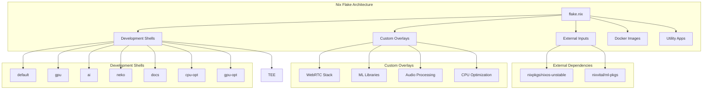

# Nix Flake Development Environment

The Neko Agent project uses a sophisticated Nix flake to provide reproducible, cross-platform development environments with specialized configurations for different use cases. This document provides comprehensive documentation of all flake features, development shells, and usage patterns.

## Overview

The flake (`flake.nix`) is designed around multiple specialized development environments that cater to different aspects of the project:

- **AI/ML Development** - GPU-accelerated environments with CUDA support
- **Documentation** - Publishing and development of project documentation
- **Container Operations** - Docker and Neko server management
- **Performance Optimization** - CPU-optimized builds with architecture-specific flags
- **TEE Deployment** - Trusted Execution Environment deployment with attestation
- **Registry Management** - Multi-registry container deployment support
- **Cross-Platform Support** - Works on x86_64-Linux and aarch64-Darwin (Apple Silicon)



## Flake Inputs

### External Dependencies

```nix
inputs = {
  nixpkgs.url = "github:NixOS/nixpkgs/nixos-unstable";
  ml-pkgs.url = "github:nixvital/ml-pkgs";
};
```

| Input | Source | Purpose |
|-------|--------|---------|
| `nixpkgs` | `nixos-unstable` | Latest packages and system libraries |
| `ml-pkgs` | `nixvital/ml-pkgs` | Specialized ML/AI packages (PyTorch, CUDA) |

**Why nixos-unstable?**
- **Latest packages** - Access to newest versions of AI/ML libraries
- **CUDA support** - Most recent NVIDIA driver and toolkit support (CUDA 12.8)
- **Python ecosystem** - Up-to-date Python packages for transformers and WebRTC
- **Security updates** - Timely security patches for all dependencies

## Build Metadata and Reproducibility

The flake includes comprehensive build metadata for reproducible builds and attestation:

```nix
buildInfo = rec {
  timestamp = "${year}-${month}-${day}T${hour}:${minute}:${second}Z";
  revision = self.rev or self.dirtyRev or "unknown";
  shortRev = builtins.substring 0 8 revision;
  version = if (self ? rev) then shortRev else "${shortRev}-dirty";
  nixpkgsRev = nixpkgs.rev or "unknown";
  
  imageMetadata = {
    "org.opencontainers.image.title" = "Neko Agent";
    "org.opencontainers.image.created" = timestamp;
    "org.opencontainers.image.revision" = revision;
    "dev.neko.build.reproducible" = "true";
  };
};
```

## Custom Overlay System

The flake uses a comprehensive overlay system to provide packages not available in standard Nixpkgs:

### WebRTC and Media Stack

```nix
nekoOverlays = [
  (import ./overlays/pylibsrtp.nix)     # Secure RTP protocol
  (import ./overlays/aioice.nix)        # Async ICE implementation  
  (import ./overlays/aiortc.nix)        # WebRTC for Python
  # ... more overlays
];
```

| Overlay | Package | Purpose |
|---------|---------|---------|
| `pylibsrtp.nix` | `pylibsrtp` | Secure Real-time Transport Protocol for WebRTC |
| `aioice.nix` | `aioice` | Asynchronous ICE (Interactive Connectivity Establishment) |
| `aiortc.nix` | `aiortc` | WebRTC implementation for Python with media support |

### AI/ML and Audio Processing

| Overlay | Package | Purpose |
|---------|---------|---------|
| `streaming.nix` | `streaming` | MosaicML Streaming for training data |
| `f5-tts.nix` | `f5-tts` | F5-TTS voice synthesis model |
| `vocos.nix` | `vocos` | Neural vocoder for audio generation |
| `ema-pytorch.nix` | `ema-pytorch` | Exponential Moving Average for PyTorch |
| `transformers-stream-generator.nix` | `transformers-stream-generator` | Streaming text generation |
| `bitsandbytes.nix` | `bitsandbytes` | 8-bit optimizers for PyTorch |

### Pi-Zero PyTorch Dependencies

The flake includes comprehensive packaging for pi-zero-pytorch and its dependencies:

| Overlay | Package | Purpose |
|---------|---------|---------|
| `pi-zero-pytorch/pi-zero-pytorch.nix` | `pi-zero-pytorch` | Main π0 implementation in PyTorch |
| `pi-zero-pytorch/einx.nix` | `einx` | Universal tensor operations with Einstein notation |
| `pi-zero-pytorch/x-transformers.nix` | `x-transformers` | Transformer architectures library |
| `pi-zero-pytorch/rotary-embedding-torch.nix` | `rotary-embedding-torch` | Rotary positional embeddings |
| `pi-zero-pytorch/accelerated-scan.nix` | `accelerated-scan` | Accelerated scan operations |
| `pi-zero-pytorch/bidirectional-cross-attention.nix` | `bidirectional-cross-attention` | Cross-attention mechanisms |
| `pi-zero-pytorch/hl-gauss-pytorch.nix` | `hl-gauss-pytorch` | Gaussian operations for ML |
| `pi-zero-pytorch/evolutionary-policy-optimization.nix` | `evolutionary-policy-optimization` | Evolution strategies |

### Performance Optimization

| Overlay | Package | Purpose |
|---------|---------|---------|
| `cached-path.nix` | `cached-path` | Efficient file caching utilities |
| `znver2-flags.nix` | `nekoZnver2Env` | AMD Zen2 CPU optimization flags |
| `vmm-cli.nix` | `vmm-cli` | Virtual machine management CLI |

**Example Znver2 Optimization**:
```bash
# Generated environment variables for AMD Zen2 CPUs
export NIX_CFLAGS_COMPILE="-O3 -pipe -march=znver2 -mtune=znver2 -fno-plt"
export RUSTFLAGS="-C target-cpu=znver2 -C target-feature=+sse2,+sse4.2,+avx,+avx2,+fma,+bmi1,+bmi2"
```

### External ML Packages

```nix
ml-pkgs.overlays.torch-family  # Provides torch-bin, torchvision-bin, etc.
```

**Benefits**:
- **Pre-compiled binaries** - Faster setup without compilation
- **CUDA integration** - Proper CUDA toolkit linkage
- **Consistent versions** - Matching PyTorch ecosystem versions

## Development Shells

### 1. Default Shell (`default`)

**Purpose**: Basic Python development with CPU-only PyTorch.

**Usage**: 
```bash
nix develop
# or
nix develop .#default
```

**Includes**:
- **Python Environment**: PyTorch CPU, Transformers, WebRTC stack
- **System Tools**: FFmpeg, Git, Curl, Just, pkg-config
- **Node.js Ecosystem**: Node 20, NPM for AI tools
- **AI CLI Tools**: OpenAI Codex, Anthropic Claude Code (auto-installed)

**Python Packages**:
```python
# Core ML/AI
transformers
torch (CPU)
torchvision
pillow
accelerate

# WebRTC and networking
websockets
av (PyAV for video processing)
pylibsrtp
aioice
aiortc

# Data and streaming
streaming (MosaicML)
f5-tts
numpy
scipy
zstandard
xxhash
tqdm

# Monitoring
prometheus-client
```

**When to Use**:
- Initial project setup and exploration
- Development on systems without NVIDIA GPUs
- Testing compatibility with CPU-only environments
- CI/CD pipelines where GPU access is unavailable

### 2. GPU Shell (`gpu`)

**Purpose**: GPU-accelerated development with CUDA 12.8 support.

**Usage**:
```bash
nix develop .#gpu
```

**Additional Features over Default**:
- **CUDA Toolkit 12.8** - Complete CUDA development environment
- **cuDNN and NCCL** - Optimized neural network and communication libraries
- **GPU-enabled PyTorch** - Tensor operations on NVIDIA GPUs
- **Environment Variables** - Automatic CUDA path and library configuration

**CUDA Environment Setup**:
```bash
# Automatically configured
export CUDA_HOME=/nix/store/.../cuda-12.8
export CUDA_PATH=$CUDA_HOME
export PATH=$CUDA_HOME/bin:$PATH
export LD_LIBRARY_PATH=$CUDA_HOME/lib64:$LD_LIBRARY_PATH

# GPU control
export NVIDIA_VISIBLE_DEVICES=all
export NVIDIA_DRIVER_CAPABILITIES=compute,utility
export CUDA_MODULE_LOADING=LAZY
export PYTORCH_CUDA_ALLOC_CONF=expandable_segments:True
```

**Verification Commands**:
```bash
# Check CUDA installation
nvidia-smi
nvcc --version

# Test PyTorch GPU support
python -c "import torch; print(f'CUDA available: {torch.cuda.is_available()}')"
python -c "import torch; print(f'CUDA devices: {torch.cuda.device_count()}')"
```

**When to Use**:
- AI model inference and training
- GPU-accelerated image/video processing
- Development requiring CUDA libraries
- Performance-critical workloads

### 3. AI Shell (`ai`)

**Purpose**: Lightweight environment focused on AI development tools.

**Usage**:
```bash
nix develop .#ai
```

**Includes**:
- **Core System Tools** - FFmpeg, Git, networking utilities
- **Node.js Environment** - Node 20, NPM
- **AI CLI Tools** - Automatic installation of OpenAI and Anthropic CLIs
- **Minimal Footprint** - No heavy ML libraries, faster startup

**AI Tools Installed**:
```bash
# OpenAI Codex CLI
npm install -g @openai/codex

# Anthropic Claude Code CLI  
npm install -g @anthropic-ai/claude-code
```

**Environment Setup**:
```bash
# NPM global packages in project directory
export NPM_CONFIG_PREFIX=$PWD/.npm-global
export PATH=$NPM_CONFIG_PREFIX/bin:$PATH
```

**When to Use**:
- AI-assisted development workflows
- Code generation and review tasks
- Integration with AI development services
- Quick environment for AI tool testing

### 4. Neko Shell (`neko`)

**Purpose**: Container and Neko server management.

**Usage**:
```bash
nix develop .#neko
```

**Container Stack**:
- **Colima** - Lightweight Docker runtime for macOS/Linux
- **Docker & Docker Compose** - Container orchestration
- **Docker Buildx** - Multi-platform image building
- **Networking Tools** - curl, jq for API interaction

**Custom Scripts**:
```bash
# Neko service management script
neko-services up      # Start Neko server
neko-services down    # Stop services
neko-services logs    # View container logs
neko-services status  # Check service status
neko-services restart # Restart services
neko-services update  # Pull latest images and restart
```

**Colima Configuration**:
```bash
# Automatically configured VM
colima start --vm-type vz --cpu 2 --memory 4 \
  --mount-type sshfs --mount "~:w"
```

**Docker Environment**:
```bash
# Automatic Docker socket configuration
export DOCKER_HOST="unix://$HOME/.colima/default/docker.sock"
```

**When to Use**:
- Neko server development and testing
- Container image building and deployment
- Docker-based development workflows
- Local testing of production deployments

### 5. Documentation Shell (`docs`)

**Purpose**: Documentation development, building, and publishing.

**Usage**:
```bash
nix develop .#docs
```

**Documentation Stack**:
- **mdBook** - Rust-based documentation generator
- **mdBook Extensions**:
  - `mdbook-mermaid` - Diagram support
  - `mdbook-linkcheck` - Link validation
  - `mdbook-toc` - Table of contents generation
- **Sphinx** - Python documentation with reStructuredText support
- **Node.js** - For additional tooling and preprocessing

**Python Documentation Tools**:
```python
sphinx              # Documentation generator
sphinx-rtd-theme     # Read the Docs theme
myst-parser          # Markdown support for Sphinx
sphinxcontrib-mermaid # Mermaid diagrams in Sphinx
```

**Available Commands**:
```bash
# From inside docs/
mdbook serve --open     # Development server with live reload
mdbook build           # Build static documentation
mdbook test            # Test code examples and links

# Sphinx alternative
sphinx-build -b html source build/
```

**When to Use**:
- Writing and editing project documentation
- Building documentation for deployment
- Testing documentation changes locally
- Contributing to API reference and guides

### 6. CPU-Optimized Shell (`cpu-opt`)

**Purpose**: Performance-optimized CPU development.

**Usage**:
```bash
nix develop .#cpu-opt
```

**Optimization Features**:
- **Architecture-Specific Compilation** - Znver2 flags for AMD CPUs
- **Optimized Python Environment** - Performance-tuned package builds
- **Compiler Optimizations** - -O3, -march=znver2, -mtune=znver2

**Generated Optimization Flags** (Linux only):
```bash
# Compiler flags
export NIX_CFLAGS_COMPILE="-O3 -pipe -march=znver2 -mtune=znver2 -fno-plt"

# Rust flags
export RUSTFLAGS="-C target-cpu=znver2 -C target-feature=+sse2,+sse4.2,+avx,+avx2,+fma,+bmi1,+bmi2 -C link-arg=-Wl,-O1 -C link-arg=--as-needed"
```

**When to Use**:
- Performance-critical CPU workloads
- Benchmarking and optimization work
- Production builds targeting specific CPU architectures
- Environments where every bit of CPU performance matters

### 7. GPU-Optimized Shell (`gpu-opt`)

**Purpose**: Maximum performance GPU development with optimizations.

**Usage**:
```bash
nix develop .#gpu-opt
```

**Combined Optimizations**:
- **All GPU features** - CUDA 12.8, cuDNN, NCCL
- **CPU optimizations** - Znver2 flags for host code
- **PyTorch optimizations** - Optimized builds with CPU and GPU acceleration
- **Memory optimizations** - Advanced CUDA memory management

**GPU-Specific Optimizations**:
```bash
# Target specific GPU architecture (configurable)
export TORCH_CUDA_ARCH_LIST=8.6  # RTX 30xx series

# Memory allocation strategy
export PYTORCH_CUDA_ALLOC_CONF=expandable_segments:True
```

**Performance Verification**:
```bash
# Check optimizations are active
echo $NIX_CFLAGS_COMPILE  # Should show znver2 flags
echo $TORCH_CUDA_ARCH_LIST  # Should show target GPU architecture

# Benchmark performance
python -c "
import torch
import time
x = torch.randn(1000, 1000, device='cuda')
start = time.time()
torch.mm(x, x)
print(f'GPU matrix multiply: {time.time() - start:.4f}s')
"
```

**When to Use**:
- Maximum performance AI inference
- GPU-accelerated training workloads
- Performance benchmarking and optimization
- Production deployments requiring peak performance

### 8. TEE Shell (`tee`)

**Purpose**: Trusted Execution Environment deployment and attestation.

**Usage**:
```bash
nix develop .#tee
```

**TEE Deployment Stack**:
- **Phala Cloud CLI** - Modern CLI for TEE deployments
- **Legacy VMM CLI** - Compatible with older dstack systems
- **Docker & Docker Compose** - Container orchestration
- **Bun Runtime** - Fast JavaScript runtime
- **Reproducible Image Builder** - Attestation-ready container building

**Available Commands**:
```bash
# Modern Phala CLI
phala auth login <api-key>      # Authenticate with Phala Cloud
phala status                    # Check authentication status
phala cvms list                 # List Confidential VMs
phala nodes                     # List available TEE nodes

# Legacy VMM CLI (if needed)
vmm-cli lsvm                    # List virtual machines
vmm-cli lsimage                 # List available images
vmm-cli lsgpu                   # List available GPUs

# Reproducible builds
nix run .#build-images          # Build reproducible images
nix run .#deploy-to-tee         # Deploy with attestation metadata
nix run .#verify-attestation    # Verify TEE attestation
```

**Multi-Registry Support**:
```bash
# Deploy to ttl.sh (ephemeral registry)
NEKO_REGISTRY=ttl.sh NEKO_TTL=1h nix run .#deploy-to-tee
nix run .#deploy-to-ttl 24h

# Deploy to GitHub Container Registry
NEKO_REGISTRY=ghcr.io/your-org nix run .#deploy-to-tee

# Deploy to Docker Hub
NEKO_REGISTRY=docker.io/your-org nix run .#deploy-to-tee

# Deploy to local registry
NEKO_REGISTRY=localhost:5000/neko nix run .#deploy-to-tee
```

**When to Use**:
- Deploying to Trusted Execution Environments
- Creating attestable, reproducible deployments
- Multi-registry container management
- TEE-based inference deployments
- Confidential computing workloads

## Docker Images and Packages

The flake builds optimized Docker images for production deployment:

### Available Images

The flake now builds multiple specialized images for different components:

```bash
# Build all images
nix run .#build-images

# Agent images
nix build .#neko-agent-docker-generic
nix build .#neko-agent-docker-opt

# Capture images  
nix build .#neko-capture-docker-generic
nix build .#neko-capture-docker-opt

# YAP (TTS) images
nix build .#neko-yap-docker-generic
nix build .#neko-yap-docker-opt

# Train images
nix build .#neko-train-docker-generic
nix build .#neko-train-docker-opt
```

### 1. Generic CUDA Image (`neko-agent-docker-generic`)

**Target**: `neko-agent:cuda12.8-generic`

**Features**:
- **Portable CUDA** - Includes PTX for forward compatibility
- **CUDA 12.8** - Full toolkit and libraries
- **Python Environment** - All dependencies with torch-bin
- **Broad GPU Support** - Works on any CUDA 8.6+ GPU

**Configuration**:
```dockerfile
# Environment variables
CUDA_HOME=/nix/store/.../cuda-12.8
LD_LIBRARY_PATH=$CUDA_HOME/lib64:$CUDA_HOME/lib
CUDA_MODULE_LOADING=LAZY
TORCH_CUDA_ARCH_LIST=8.6+PTX  # Forward compatibility
```

**Use Cases**:
- Multi-GPU deployment environments
- Cloud platforms with varying GPU types
- Development and testing across different hardware

### 2. Optimized Image (`neko-agent-docker-opt`)

**Target**: `neko-agent:cuda12.8-sm86-v3`

**Features**:
- **Specific GPU targeting** - Optimized for RTX 30xx series (sm_86)
- **CPU optimizations** - Znver2 architecture flags
- **Smaller size** - No PTX, specific architecture only
- **Maximum performance** - All available optimizations enabled

**Configuration**:
```dockerfile
# Optimized environment
TORCH_CUDA_ARCH_LIST=8.6  # Specific architecture only
NIX_CFLAGS_COMPILE="-O3 -pipe -march=znver2 -mtune=znver2 -fno-plt"
RUSTFLAGS="-C target-cpu=znver2 ..."  # Rust optimizations
```

**Use Cases**:
- Production deployments with known hardware
- Performance-critical applications
- Cost-optimized cloud instances

### Image Building System

```nix
# Helper function for consistent container structure
mkRoot = paths: pkgs.buildEnv {
  name = "image-root";
  inherit paths;
  pathsToLink = [ "/bin" ];
};

# Generic image build
neko-agent-docker-generic = pkgs.dockerTools.buildImage {
  name = "neko-agent:cuda12.8-generic";
  created = "now";
  copyToRoot = mkRoot ([
    runnerGeneric
    pyEnvGeneric
    cuda.cudatoolkit
    cuda.cudnn
    cuda.nccl
    pkgs.bashInteractive
  ] ++ commonSystemPackages);
  config = {
    Env = baseEnv ++ [
      "CUDA_HOME=${cuda.cudatoolkit}"
      "LD_LIBRARY_PATH=${cuda.cudatoolkit}/lib64:${cuda.cudnn}/lib"
      "TORCH_CUDA_ARCH_LIST=8.6+PTX"
    ];
    WorkingDir = "/workspace";
    Entrypoint = [ "/bin/neko-agent" ];
  };
};
```

## Utility Apps

The flake provides comprehensive utility applications for common tasks:

### Documentation Apps

```bash
# Build documentation
nix run .#docs-build

# Serve documentation with live reload
nix run .#docs-serve

# Check documentation for issues
nix run .#docs-check
```

### Build and Deployment Apps

```bash
# Build all Docker images with attestation metadata
nix run .#build-images

# TEE deployment with multi-registry support
nix run .#deploy-to-tee
nix run .#deploy-to-ttl 24h              # Quick ttl.sh deployment
nix run .#push-to-ttl 1h                 # Just push to ttl.sh

# Attestation verification
nix run .#verify-attestation <app-id> <expected-hash>
```

### Container Registry Apps

```bash
# Local registry management
nix run .#start-registry                 # HTTP registry with auth
nix run .#start-registry-https           # HTTPS with Tailscale certs
nix run .#stop-registry

# Public exposure
nix run .#start-tailscale-funnel         # Expose via Tailscale Funnel
nix run .#start-cloudflare-tunnel        # Expose via Cloudflare Tunnel
```

**Registry Configuration Examples**:
```bash
# Environment variables for registry customization
NEKO_REGISTRY_PORT=5000
NEKO_REGISTRY_USER=neko
NEKO_REGISTRY_PASSWORD=pushme
NEKO_REGISTRY_DATA_DIR=$PWD/registry-data
NEKO_REGISTRY_AUTH_DIR=$PWD/auth
NEKO_REGISTRY_CERTS_DIR=$PWD/certs

# Tailscale Funnel setup
NEKO_REGISTRY=your-device.tail-scale.ts.net/neko

# Cloudflare Tunnel setup
NEKO_CF_TUNNEL_NAME=neko-registry
NEKO_CF_HOSTNAME=registry.example.com
```

## Common Development Workflows

### Initial Setup

```bash
# Clone repository
git clone <repo-url>
cd neko-agent

# Enter development environment
nix develop .#gpu  # or .#default for CPU-only

# Verify setup
python -c "import torch; print(torch.cuda.is_available())"
```

### AI Development Workflow

```bash
# 1. Enter GPU environment
nix develop .#gpu

# 2. Load environment variables (if .env exists)
# Automatically loaded by shell hook

# 3. Test model loading
python -c "
from transformers import Qwen2VLForConditionalGeneration
model = Qwen2VLForConditionalGeneration.from_pretrained('showlab/ShowUI-2B')
print('Model loaded successfully')
"

# 4. Run agent
python src/agent.py --task "Navigate to google.com"
```

### Documentation Development

```bash
# 1. Enter docs environment
nix develop .#docs

# 2. Start development server
nix run .#docs-serve
# Opens browser to http://localhost:3000

# 3. Edit files in docs/src/
# Changes automatically reload in browser

# 4. Build for deployment
nix run .#docs-build
```

### Container Development

```bash
# 1. Enter container environment
nix develop .#neko

# 2. Start Neko server
neko-services up

# 3. Check status
neko-services status

# 4. View logs
neko-services logs neko

# 5. Test connection
curl http://localhost:8080/health
```

### Performance Optimization

```bash
# 1. Use optimized environment
nix develop .#gpu-opt

# 2. Verify optimizations
echo $NIX_CFLAGS_COMPILE
echo $TORCH_CUDA_ARCH_LIST

# 3. Run performance benchmarks
python benchmarks/inference_speed.py

# 4. Build optimized container
nix build .#neko-agent-docker-opt
```

### TEE Deployment Workflow

```bash
# 1. Enter TEE environment
nix develop .#tee

# 2. Build reproducible images
nix run .#build-images

# 3. Deploy to TEE (with registry choice)
# Option A: Use ttl.sh for testing
nix run .#deploy-to-ttl 1h

# Option B: Use GitHub Container Registry
NEKO_REGISTRY=ghcr.io/your-org nix run .#deploy-to-tee

# Option C: Use local registry (start it first)
nix run .#start-registry  # In another terminal
NEKO_REGISTRY=localhost:5000/neko nix run .#deploy-to-tee

# 4. Verify attestation (inside TEE)
nix run .#verify-attestation <app-id> <compose-hash>

# 5. Check deployment status
phala cvms list  # Modern CLI
# or
vmm-cli lsvm    # Legacy CLI
```

### Multi-Registry Development

```bash
# Setup local registry for testing
nix run .#start-registry

# Push images to multiple registries
docker tag neko-agent:latest localhost:5000/neko/agent:v1
docker push localhost:5000/neko/agent:v1

# Use Tailscale for team access
nix run .#start-tailscale-funnel

# Use Cloudflare for public access
nix run .#start-cloudflare-tunnel
```

## Environment Variables and Configuration

### Automatic .env Loading

All development shells automatically load `.env` files:

```bash
# .env file example
NEKO_WS=ws://localhost:8080/api/ws
NEKO_LOGLEVEL=DEBUG
CUDA_VISIBLE_DEVICES=0
TORCH_CUDA_ARCH_LIST=8.6
```

### Common Environment Variables

| Variable | Purpose | Default | Set By |
|----------|---------|---------|--------|
| `CUDA_HOME` | CUDA installation path | Auto-detected | GPU shells |
| `CUDA_VISIBLE_DEVICES` | GPU selection | `all` | User configurable |
| `PYTORCH_CUDA_ALLOC_CONF` | Memory strategy | `expandable_segments:True` | GPU shells |
| `NPM_CONFIG_PREFIX` | NPM global location | `$PWD/.npm-global` | All shells |
| `NIX_CFLAGS_COMPILE` | Compiler optimizations | Znver2 flags | Optimized shells |

### Shell-Specific Variables

**GPU Shells**:
```bash
export CUDA_MODULE_LOADING=LAZY
export NVIDIA_DRIVER_CAPABILITIES=compute,utility
export LD_LIBRARY_PATH=$CUDA_HOME/lib64:$CUDA_HOME/lib
```

**Documentation Shell**:
```bash
# No specific variables, uses standard tool defaults
```

**Container Shell**:
```bash
export DOCKER_HOST="unix://$HOME/.colima/default/docker.sock"
```

## Cross-Platform Support

### Supported Systems

```nix
supportedSystems = [ "x86_64-linux" "aarch64-darwin" ];
```

### Platform-Specific Features

**x86_64-Linux**:
- **Full GPU support** - NVIDIA CUDA, Docker GPU passthrough
- **CPU optimizations** - Znver2, Intel architecture targeting
- **Container building** - Docker images with CUDA support

**aarch64-Darwin (Apple Silicon)**:
- **Metal Performance Shaders** - GPU acceleration via MPS
- **Rosetta compatibility** - x86_64 dependencies when needed
- **Native performance** - ARM64-optimized packages

### Platform Detection

```nix
# Conditional features based on platform
${pkgs.lib.optionalString pkgs.stdenv.isLinux ''
  source ${znver2File}
  echo "[cpu-opt] Using znver2 flags: $NIX_CFLAGS_COMPILE"
''}
```

## Troubleshooting

### Common Issues

**CUDA Not Detected**:
```bash
# Check NVIDIA drivers
nvidia-smi

# Verify CUDA environment
echo $CUDA_HOME
echo $LD_LIBRARY_PATH

# Test PyTorch CUDA
python -c "import torch; print(torch.cuda.is_available())"
```

**Solution**: Ensure NVIDIA drivers are installed and compatible with CUDA 12.8.

**Docker Issues on macOS**:
```bash
# Check Colima status
colima status

# Restart if needed
colima stop
colima start --vm-type vz --cpu 2 --memory 4
```

**Slow Package Installation**:
```bash
# Use binary cache
echo "substituters = https://cache.nixos.org https://cuda-maintainers.cachix.org" >> ~/.config/nix/nix.conf
echo "trusted-public-keys = cache.nixos.org-1:6NCHdD59X431o0gWypbMrAURkbJ16ZPMQFGspcDShjY= cuda-maintainers.cachix.org-1:0dq3bujKpuEPiCgBv7/11NEBpCcEKUzZzUNjRgPTOOA=" >> ~/.config/nix/nix.conf
```

### Memory Issues

**GPU Memory**:
```bash
# Monitor GPU memory
nvidia-smi -l 1

# Optimize PyTorch memory
export PYTORCH_CUDA_ALLOC_CONF=max_split_size_mb:128,expandable_segments:True
```

**System Memory**:
```bash
# Check available memory
free -h

# Monitor during development
htop
```

### Performance Issues

**Check Optimizations**:
```bash
# Verify CPU flags
cat /proc/cpuinfo | grep flags

# Check compiler optimizations
echo $NIX_CFLAGS_COMPILE

# Benchmark inference
python -c "
import torch
import time
device = 'cuda' if torch.cuda.is_available() else 'cpu'
x = torch.randn(1000, 1000, device=device)
start = time.time()
result = torch.mm(x, x)
print(f'{device} time: {time.time() - start:.4f}s')
"
```

## Advanced Usage

### Custom Overlays

Create project-specific overlays in `overlays/`:

```nix
# overlays/custom-package.nix
final: prev: {
  custom-package = prev.python3Packages.buildPythonPackage {
    pname = "custom-package";
    version = "1.0.0";
    src = prev.fetchFromGitHub {
      owner = "owner";
      repo = "repo";
      rev = "v1.0.0";
      sha256 = "...";
    };
    propagatedBuildInputs = with prev.python3Packages; [
      numpy
      torch
    ];
  };
}
```

### Custom Development Shells

Add new shells to the flake:

```nix
# Add to devShells
experimental = pkgs.mkShell {
  buildInputs = commonSystemPackages ++ [
    # Custom packages
  ];
  shellHook = ''
    echo "Experimental environment loaded"
    # Custom setup
  '';
};
```

### Environment Specialization

Create environment-specific configurations:

```bash
# .env.gpu
CUDA_VISIBLE_DEVICES=0
TORCH_CUDA_ARCH_LIST=8.6

# .env.multi-gpu  
CUDA_VISIBLE_DEVICES=0,1,2,3
NCCL_DEBUG=INFO

# Load specific environment
cp .env.gpu .env
nix develop .#gpu
```

## Contributing to the Flake

### Adding New Packages

1. **Create overlay** in `overlays/new-package.nix`
2. **Add to overlay list** in `nekoOverlays`
3. **Include in appropriate shells**
4. **Test across platforms**
5. **Update documentation**

### Testing Changes

```bash
# Test specific shell
nix develop .#shell-name --command python -c "import new_package"

# Test all shells
for shell in default gpu ai neko docs cpu-opt gpu-opt; do
  echo "Testing $shell..."
  nix develop .#$shell --command echo "✓ $shell loads successfully"
done

# Test image builds
nix build .#neko-agent-docker-generic
nix build .#neko-agent-docker-opt
```

### Performance Considerations

- **Binary caches** - Use Cachix for custom packages
- **Layer optimization** - Minimize Docker image layers
- **Dependency management** - Avoid unnecessary dependencies
- **Build reproducibility** - Pin package versions when needed

This comprehensive flake system provides a robust, reproducible development environment that scales from local development to production deployment while maintaining consistency across different platforms and use cases.