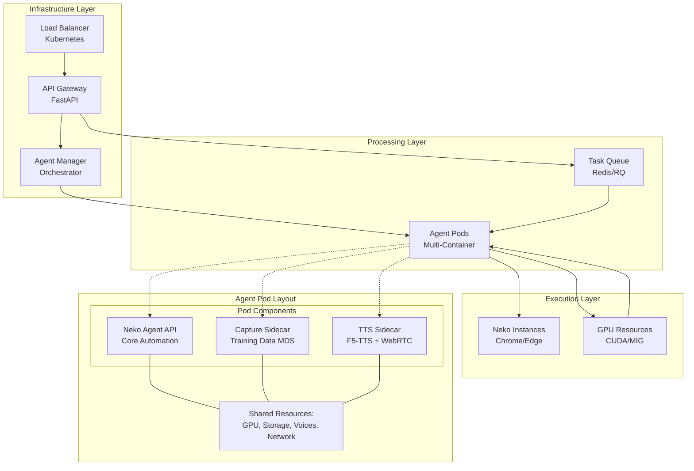

# Neko Agent API Mode - Architecture Design Document

## Executive Summary

This document outlines the design for a new `--api` mode for the Neko Agent system that exposes the existing WebRTC-based GUI automation agent as a RESTful API service. The design includes containerization, orchestration with Kubernetes, load balancing, and auto-scaling strategies to handle production workloads.

## Current Architecture Analysis

### Existing System (`src/agent.py`)

The current Neko Agent is a WebRTC-based GUI automation system with the following key components:

- **NekoAgent Class**: Core agent that manages WebRTC connections and performs GUI automation
- **WebRTC Integration**: Uses aiortc for peer-to-peer connections with Neko Chrome containers  
- **AI Model**: ShowUI-2B (Qwen2VL) for visual reasoning and action planning
- **Action Execution**: Supports CLICK, INPUT, SCROLL, SWIPE, TAP, ANSWER actions
- **Signaling**: WebSocket-based communication with Neko server
- **Frame Processing**: Real-time video frame capture and analysis
- **Metrics**: Prometheus integration for monitoring

### Current Limitations for API Mode

1. **Single Session**: Designed for one agent per WebRTC connection
2. **Blocking Operations**: Synchronous task execution model
3. **No Request Queuing**: No API endpoint abstraction
4. **Resource Management**: No dynamic resource allocation
5. **Scaling Constraints**: Manual deployment and management

## Proposed API Mode Architecture

### 1. System Overview



### 2. Core Components

#### 2.1 Training Data Capture Service (`src/capture.py`)

**Technology**: Python with MosaicML Streaming, WebSocket client, HTTP polling

**Purpose**: Captures training data from Neko sessions for model improvement and fine-tuning

**Responsibilities**:
- Real-time episode recording during agent sessions
- Screenshot capture at configurable FPS via HTTP polling
- Action annotation parsing from chat messages
- MDS (MosaicML Streaming) shard generation with S3 upload
- Episode lifecycle management with automatic timeout handling

**Integration with API Mode**:
- Runs as sidecar container alongside agent instances
- Monitors WebSocket chat for `/start`, `/stop`, and `Action:` commands
- Captures synchronized video frames and action annotations
- Outputs training episodes as ZIP archives in MDS format
- Supports remote storage (S3) for distributed training pipelines

**Key Features**:
- **Episode-based Recording**: Packages complete task sessions as single training samples
- **Streaming Upload**: Direct-to-S3 capability with local/remote storage options
- **Frame Synchronization**: Precise timestamp alignment between actions and screenshots
- **Compression**: ZSTD compression for efficient storage and transfer
- **12-Factor Compliance**: Configuration via environment variables only

#### 2.2 Text-to-Speech Service (`src/yap.py`)

**Technology**: F5-TTS, aiortc WebRTC audio, PyAV, asyncio

**Purpose**: Provides real-time voice synthesis and audio streaming to Neko sessions

**Responsibilities**:
- F5-TTS voice synthesis with custom voice models
- Real-time audio streaming via WebRTC
- Voice management and hot-reloading
- Punctuation-aware text segmentation
- Low-latency audio pipeline with jitter buffering

**Integration with API Mode**:
- Deploys as companion service for agent instances
- WebRTC audio track injection into Neko sessions
- Chat command interface for voice control
- Streaming and batch TTS modes
- Voice configuration management via JSON registry

**Key Features**:
- **Multi-Voice Support**: Hot-reloadable voice registry with custom models
- **Streaming TTS**: `/yap:begin` ... `/yap:end` for incremental synthesis
- **Low Latency**: Parallel TTS workers with crossfade audio splicing
- **Voice Customization**: Live rate/pitch adjustments and style parameters
- **Production Audio**: 48kHz WebRTC-compatible output with jitter buffering

#### 2.3 API Gateway Service

**Technology**: FastAPI with async/await support

**Responsibilities**:
- HTTP request handling and validation
- Authentication and authorization
- Rate limiting and quotas
- Request/response transformation
- API documentation (OpenAPI/Swagger)
- Health checks and metrics

**Key Endpoints**:

```python
# Core automation tasks
POST /api/v1/tasks              # Create new automation task
GET  /api/v1/tasks/{task_id}    # Get task status and results
PUT  /api/v1/tasks/{task_id}    # Update task parameters
DELETE /api/v1/tasks/{task_id}  # Cancel running task
GET  /api/v1/tasks              # List tasks with filtering
POST /api/v1/sessions           # Create persistent session

# Training data capture
POST /api/v1/capture/episodes   # Start episode recording
GET  /api/v1/capture/episodes/{episode_id}  # Get episode status
DELETE /api/v1/capture/episodes/{episode_id}  # Stop episode recording
GET  /api/v1/capture/datasets   # List available training datasets
POST /api/v1/capture/datasets/{dataset_id}/upload  # Upload to remote storage
GET  /api/v1/capture/config     # Get capture configuration
PUT  /api/v1/capture/config     # Update capture settings

# Text-to-Speech and voice
POST /api/v1/tts/speak          # Immediate text-to-speech
POST /api/v1/tts/stream/start   # Begin streaming TTS session
POST /api/v1/tts/stream/text    # Add text to streaming session
POST /api/v1/tts/stream/stop    # End streaming TTS session
DELETE /api/v1/tts/stop         # Stop all TTS and clear queue

# Voice management
GET  /api/v1/voices             # List available voices
POST /api/v1/voices             # Add new voice
GET  /api/v1/voices/{voice_id}  # Get voice details
PUT  /api/v1/voices/{voice_id}  # Update voice configuration
DELETE /api/v1/voices/{voice_id}  # Remove voice
POST /api/v1/voices/reload      # Hot-reload voice registry

# System
GET  /api/v1/health             # Health check endpoint
GET  /api/v1/metrics            # Prometheus metrics
```

**Request/Response Format**:

```json
// POST /api/v1/tasks - Core automation task
{
  "task": "Search for Python tutorials on YouTube",
  "mode": "web",
  "max_steps": 10,
  "timeout": 300,
  "callback_url": "https://app.example.com/webhook",
  "options": {
    "screen_resolution": "1920x1080",
    "save_screenshots": true,
    "refinement_steps": 5,
    "enable_capture": true,     // Enable training data capture
    "enable_tts": true,         // Enable voice output
    "voice_id": "default"       // Voice for TTS
  }
}

// Response
{
  "task_id": "task_123456",
  "status": "queued",
  "created_at": "2024-01-15T10:30:00Z",
  "estimated_completion": "2024-01-15T10:35:00Z"
}

// POST /api/v1/capture/episodes - Start training capture
{
  "task_description": "Navigate to YouTube and search for tutorials",
  "neko_session_id": "session_abc123",
  "capture_options": {
    "fps": 2.0,
    "jpeg_quality": 85,
    "min_frames": 4,
    "timeout_seconds": 900
  }
}

// Response
{
  "episode_id": "episode_xyz789",
  "status": "recording",
  "started_at": "2024-01-15T10:30:00Z",
  "estimated_size_mb": 120
}

// POST /api/v1/tts/speak - Immediate TTS
{
  "text": "I'm now searching for Python tutorials on YouTube",
  "voice_id": "instructor",
  "params": {
    "rate": 1.0,
    "pitch": 0.0
  }
}

// Response
{
  "request_id": "tts_req_456",
  "status": "speaking",
  "estimated_duration_ms": 3500
}

// POST /api/v1/voices - Add new voice
{
  "voice_id": "instructor",
  "ref_audio": "/voices/instructor.wav",
  "ref_text": "This is an instructional voice for tutorials",
  "styles": ["calm", "explanatory"],
  "params": {
    "rate": 0.95,
    "pitch": -1.0
  }
}

// Response
{
  "voice_id": "instructor",
  "status": "registered",
  "created_at": "2024-01-15T10:30:00Z"
}
```

#### 2.2 Agent Manager (Orchestrator)

**Technology**: Python with asyncio, Kubernetes Python client

**Responsibilities**:
- Agent lifecycle management
- Resource allocation and cleanup
- Task routing to available agents
- Agent health monitoring
- Scaling decisions based on queue depth

**Architecture**:

```python
class AgentManager:
    def __init__(self):
        self.k8s_client = kubernetes.client.ApiClient()
        self.agent_pools = {}
        self.task_queue = RedisQueue()
        self.metrics = PrometheusMetrics()
    
    async def provision_agent(self, requirements: AgentRequirements) -> AgentInstance
    async def scale_agent_pool(self, pool_name: str, replicas: int)
    async def route_task(self, task: Task) -> AgentInstance
    async def cleanup_completed_agents(self)
```

#### 2.3 Modified Agent Core

**Changes to `src/agent.py`**:

```python
class APINekoAgent(NekoAgent):
    def __init__(self, *args, api_mode=True, **kwargs):
        super().__init__(*args, **kwargs)
        self.api_mode = api_mode
        self.current_task = None
        self.task_queue = asyncio.Queue()
        
    async def api_run(self) -> None:
        """API mode main loop - processes tasks from queue"""
        while not self.shutdown.is_set():
            try:
                task = await self.task_queue.get()
                self.current_task = task
                result = await self.execute_task(task)
                await self.report_result(result)
            except Exception as e:
                await self.report_error(e)
    
    async def execute_task(self, task: APITask) -> TaskResult:
        """Execute single API task and return results"""
        self.nav_task = task.description
        # Existing navigation logic with API adaptations
        return TaskResult(task_id=task.id, status="completed", ...)
```

### 3. Containerization Strategy

#### 3.1 Multi-Stage Docker Build

```dockerfile
# Base image with CUDA support for GPU inference
FROM nvidia/cuda:12.1-runtime-ubuntu22.04 as base

# Python environment setup
RUN apt-get update && apt-get install -y \
    python3.11 python3-pip \
    libgl1-mesa-glx libglib2.0-0 \
    && rm -rf /var/lib/apt/lists/*

# Dependencies stage
FROM base as deps
COPY requirements.txt .
RUN pip install --no-cache-dir -r requirements.txt

# Model download stage (optional optimization)
FROM deps as models
RUN python -c "from transformers import Qwen2VLForConditionalGeneration; \
    Qwen2VLForConditionalGeneration.from_pretrained('showlab/ShowUI-2B')"

# Application stage  
FROM models as app
WORKDIR /app
COPY src/ ./src/
COPY pyproject.toml ./
RUN pip install -e .

# API mode entrypoint
CMD ["python", "-m", "agent", "--api", "--port", "8000"]
```

**Capture Service Dockerfile**:
```dockerfile
FROM python:3.11-slim as base

# System dependencies
RUN apt-get update && apt-get install -y \
    libgl1-mesa-glx libglib2.0-0 \
    && rm -rf /var/lib/apt/lists/*

# Python dependencies
COPY requirements-capture.txt .
RUN pip install --no-cache-dir -r requirements-capture.txt

# Application
WORKDIR /app
COPY src/capture.py ./src/
COPY pyproject.toml ./
RUN pip install -e .

# Health check
HEALTHCHECK --interval=30s --timeout=10s --start-period=10s --retries=3 \
    CMD python -c "import capture; print('ok')"

# Entry point
CMD ["python", "src/capture.py"]
```

**TTS Service Dockerfile**:
```dockerfile
FROM nvidia/cuda:12.1-runtime-ubuntu22.04 as base

# System dependencies for audio processing
RUN apt-get update && apt-get install -y \
    python3.11 python3-pip \
    libsndfile1 libasound2-dev \
    ffmpeg libavcodec-dev libavformat-dev \
    && rm -rf /var/lib/apt/lists/*

# Python dependencies including F5-TTS
COPY requirements-tts.txt .
RUN pip install --no-cache-dir -r requirements-tts.txt

# Download F5-TTS models (optional optimization)
RUN python -c "from f5_tts.api import F5TTS; F5TTS()"

# Application
WORKDIR /app
COPY src/yap.py ./src/
COPY voices/ ./voices/
COPY pyproject.toml ./
RUN pip install -e .

# Health check
HEALTHCHECK --interval=30s --timeout=10s --start-period=30s --retries=3 \
    CMD python -c "from yap import Settings; s=Settings(); print('ok' if s.validate()==[] else 'fail')"

# Entry point
CMD ["python", "src/yap.py"]
```

#### 3.2 Container Images

**Agent Image**: `neko-agent-api:latest`
- Contains the modified agent with API capabilities
- GPU-enabled for model inference
- Health checks and graceful shutdown
- Prometheus metrics export

**Gateway Image**: `neko-api-gateway:latest` 
- FastAPI application
- Authentication middleware
- Rate limiting and request validation
- OpenAPI documentation

**Manager Image**: `neko-agent-manager:latest`
- Kubernetes orchestration logic
- Agent lifecycle management
- Auto-scaling algorithms

**Capture Image**: `neko-capture:latest`
- Training data capture service (`src/capture.py`)
- MosaicML Streaming for MDS shard generation
- S3-compatible storage support for remote upload
- WebSocket client for Neko session monitoring
- Screenshot polling and episode management

**TTS Image**: `neko-yap:latest`
- Text-to-speech service (`src/yap.py`)
- F5-TTS model inference with GPU acceleration
- WebRTC audio streaming capabilities
- Voice management and hot-reloading
- Real-time audio pipeline with jitter buffering

**Voice Registry Sidecar**: `neko-voices:latest`
- Shared voice model storage
- Voice file hosting and management
- Hot-reloadable voice configurations
- Persistent volume for voice assets

### 4. Kubernetes Deployment

#### 4.1 Namespace Organization

```yaml
apiVersion: v1
kind: Namespace
metadata:
  name: neko-agents
  labels:
    app: neko-agent-system
---
# Resource quotas and limits
apiVersion: v1
kind: ResourceQuota
metadata:
  name: neko-agents-quota
  namespace: neko-agents
spec:
  hard:
    requests.nvidia.com/gpu: "20"
    limits.memory: "200Gi"
    persistentvolumeclaims: "10"
```

#### 4.2 Enhanced Agent Deployment with Sidecars

```yaml
apiVersion: apps/v1
kind: Deployment
metadata:
  name: neko-agent-pool
  namespace: neko-agents
spec:
  replicas: 3
  selector:
    matchLabels:
      app: neko-agent
  template:
    metadata:
      labels:
        app: neko-agent
    spec:
      nodeSelector:
        accelerator: nvidia-tesla-t4
      volumes:
      - name: voices-storage
        persistentVolumeClaim:
          claimName: neko-voices-pvc
      - name: capture-storage
        emptyDir: {}
      containers:
      # Main agent container
      - name: neko-agent
        image: neko-agent-api:latest
        resources:
          requests:
            nvidia.com/gpu: 1
            memory: "4Gi"
            cpu: "2"
          limits:
            nvidia.com/gpu: 1
            memory: "8Gi"
            cpu: "4"
        env:
        - name: NEKO_API_MODE
          value: "true"
        - name: CUDA_VISIBLE_DEVICES
          value: "0"
        ports:
        - containerPort: 8000
          name: api
        - containerPort: 9000
          name: metrics
        livenessProbe:
          httpGet:
            path: /health
            port: 8000
          initialDelaySeconds: 30
          periodSeconds: 10
      
      # Training data capture sidecar
      - name: neko-capture
        image: neko-capture:latest
        env:
        - name: NEKO_WS
          value: "ws://localhost:8000/api/ws"
        - name: CAPTURE_OUT
          value: "/capture/mds"
        - name: CAPTURE_REMOTE
          valueFrom:
            secretKeyRef:
              name: neko-s3-config
              key: remote_uri
              optional: true
        - name: AWS_ACCESS_KEY_ID
          valueFrom:
            secretKeyRef:
              name: neko-s3-config
              key: access_key_id
              optional: true
        - name: AWS_SECRET_ACCESS_KEY
          valueFrom:
            secretKeyRef:
              name: neko-s3-config
              key: secret_access_key
              optional: true
        volumeMounts:
        - name: capture-storage
          mountPath: /capture
        resources:
          requests:
            memory: "512Mi"
            cpu: "0.5"
          limits:
            memory: "1Gi"
            cpu: "1"
      
      # TTS sidecar
      - name: neko-yap
        image: neko-yap:latest
        env:
        - name: YAP_WS
          value: "ws://localhost:8000/api/ws"
        - name: YAP_VOICES_DIR
          value: "/voices"
        - name: YAP_SR
          value: "48000"
        - name: YAP_PARALLEL
          value: "2"
        volumeMounts:
        - name: voices-storage
          mountPath: /voices
        resources:
          requests:
            nvidia.com/gpu: 0.5  # GPU sharing with main agent
            memory: "2Gi"
            cpu: "1"
          limits:
            nvidia.com/gpu: 0.5
            memory: "4Gi"
            cpu: "2"
        livenessProbe:
          exec:
            command:
            - python
            - -c
            - "from yap import Settings; s=Settings(); exit(0 if s.validate()==[] else 1)"
          initialDelaySeconds: 45
          periodSeconds: 30
```

#### 4.3 Persistent Storage for Voices

```yaml
# Persistent Volume Claim for voice assets
apiVersion: v1
kind: PersistentVolumeClaim
metadata:
  name: neko-voices-pvc
  namespace: neko-agents
spec:
  accessModes:
    - ReadWriteMany  # Multiple pods can mount
  resources:
    requests:
      storage: 10Gi
  storageClassName: nfs-client  # Use NFS or similar for shared access
---
# Secret for S3 configuration (training data upload)
apiVersion: v1
kind: Secret
metadata:
  name: neko-s3-config
  namespace: neko-agents
type: Opaque
stringData:
  remote_uri: "s3://neko-training-data/episodes"
  access_key_id: "AKIA..."
  secret_access_key: "..."
  region: "us-west-2"
```

#### 4.4 Service Configuration

```yaml
# Service for agent API endpoints
apiVersion: v1
kind: Service
metadata:
  name: neko-agent-service
  namespace: neko-agents
spec:
  selector:
    app: neko-agent
  ports:
  - name: api
    port: 8000
    targetPort: 8000
  - name: metrics
    port: 9000
    targetPort: 9000
  type: ClusterIP
---
# Headless service for TTS WebRTC (if needed)
apiVersion: v1
kind: Service
metadata:
  name: neko-tts-service
  namespace: neko-agents
spec:
  selector:
    app: neko-agent
  ports:
  - name: webrtc
    port: 8080
    targetPort: 8080
    protocol: UDP
  clusterIP: None
```

#### 4.5 Horizontal Pod Autoscaler

```yaml
apiVersion: autoscaling/v2
kind: HorizontalPodAutoscaler
metadata:
  name: neko-agent-hpa
  namespace: neko-agents
spec:
  scaleTargetRef:
    apiVersion: apps/v1
    kind: Deployment
    name: neko-agent-pool
  minReplicas: 2
  maxReplicas: 20
  metrics:
  - type: Resource
    resource:
      name: cpu
      target:
        type: Utilization
        averageUtilization: 70
  - type: Resource
    resource:
      name: nvidia.com/gpu
      target:
        type: Utilization
        averageUtilization: 80
  - type: Pods
    pods:
      metric:
        name: task_queue_length
      target:
        type: AverageValue
        averageValue: "5"
```

### 5. Load Balancing and Auto-Scaling Strategy

#### 5.1 Multi-Tier Load Balancing

**Tier 1: External Load Balancer**
- Cloud provider load balancer (ALB/GKE/AKS)
- SSL termination and geographical routing
- Health checks and failover

**Tier 2: Ingress Controller**
- NGINX Ingress with session affinity
- Rate limiting and request buffering
- WebSocket upgrade support for agent communication

**Tier 3: Service Mesh (Optional)**
- Istio for advanced traffic management
- Circuit breaker patterns
- Observability and tracing

#### 5.2 Intelligent Auto-Scaling

**Queue-Based Scaling**:
```python
class QueueBasedScaler:
    def __init__(self):
        self.queue_threshold_scale_up = 10
        self.queue_threshold_scale_down = 2
        self.avg_task_duration = 30  # seconds
        
    def calculate_desired_replicas(self, queue_length: int, current_replicas: int) -> int:
        if queue_length > self.queue_threshold_scale_up:
            # Predictive scaling based on queue growth rate
            desired = min(current_replicas * 2, max_replicas)
        elif queue_length < self.queue_threshold_scale_down:
            desired = max(current_replicas // 2, min_replicas)
        else:
            desired = current_replicas
        return desired
```

**GPU Utilization Scaling**:
- Monitor GPU memory usage and compute utilization
- Scale up when average GPU utilization > 80%
- Scale down when GPU utilization < 30% for 5 minutes

**Cost-Optimized Node Selection**:
- Prefer spot instances for batch workloads
- Use GPU node pools with automatic provisioning
- Implement preemption handling for graceful task migration

#### 5.3 Advanced Scaling Features

**Predictive Scaling** (2024 Best Practice):

**Model Selection Rationale**:
For Neko Agent workloads, we recommend a **Prophet + XGBoost ensemble** approach due to:
- Variable task durations (30s to 30+ minutes)
- Bursty request patterns with business hour seasonality
- Multi-dimensional resource requirements (CPU, GPU, memory)
- Need for 5-15 minute prediction horizon to account for container startup times

**Core Implementation**:
```python
import numpy as np
import pandas as pd
from prophet import Prophet
import xgboost as xgb
from sklearn.ensemble import VotingRegressor
from typing import Dict, List, Tuple, Optional
import asyncio
import logging
from dataclasses import dataclass
from datetime import datetime, timedelta

@dataclass
class LoadPrediction:
    timestamp: datetime
    predicted_requests: float
    predicted_gpu_hours: float
    predicted_memory_gb: float
    confidence_interval: Tuple[float, float]
    recommendation: str  # 'scale_up', 'scale_down', 'maintain'

class NekoLoadPredictor:
    """
    Ensemble model for predicting Neko Agent resource demands.
    
    Uses Prophet for seasonality/trends + XGBoost for complex patterns.
    Optimized for multi-container pods with GPU sharing constraints.
    """
    
    def __init__(self, prediction_horizon_minutes: int = 10):
        self.horizon = prediction_horizon_minutes
        self.prophet_model = None
        self.xgb_model = None
        self.ensemble_model = None
        self.feature_columns = [
            'hour_of_day', 'day_of_week', 'is_weekend', 'is_holiday',
            'queue_depth', 'avg_task_duration', 'active_pods',
            'gpu_utilization_pct', 'memory_utilization_pct',
            'requests_last_5min', 'requests_last_15min', 'requests_last_hour',
            'tts_requests_ratio', 'capture_enabled_ratio'
        ]
        self.logger = logging.getLogger(__name__)
        
    def _engineer_features(self, 
                          historical_metrics: pd.DataFrame, 
                          current_time: datetime) -> pd.DataFrame:
        """
        Engineer features for prediction model.
        
        :param historical_metrics: Time series of system metrics
        :param current_time: Current timestamp for prediction
        :return: Engineered feature DataFrame
        """
        df = historical_metrics.copy()
        
        # Time-based features
        df['hour_of_day'] = df['timestamp'].dt.hour
        df['day_of_week'] = df['timestamp'].dt.dayofweek
        df['is_weekend'] = df['day_of_week'].isin([5, 6]).astype(int)
        df['is_holiday'] = df['timestamp'].dt.date.isin(self._get_holidays()).astype(int)
        
        # Rolling window features
        df['requests_last_5min'] = df['request_count'].rolling('5min').sum()
        df['requests_last_15min'] = df['request_count'].rolling('15min').sum()
        df['requests_last_hour'] = df['request_count'].rolling('60min').sum()
        
        # Task complexity indicators
        df['avg_task_duration'] = df['total_task_seconds'].rolling('15min').sum() / df['request_count'].rolling('15min').sum()
        df['tts_requests_ratio'] = df['tts_requests'] / df['request_count'].clip(lower=1)
        df['capture_enabled_ratio'] = df['capture_requests'] / df['request_count'].clip(lower=1)
        
        # Resource utilization
        df['gpu_utilization_pct'] = df['gpu_memory_used'] / df['gpu_memory_total'] * 100
        df['memory_utilization_pct'] = df['memory_used'] / df['memory_total'] * 100
        
        return df.fillna(0)
    
    def _get_holidays(self) -> List[datetime]:
        """Get list of holidays that might affect traffic patterns."""
        # Simplified - in production, use holidays library
        return [
            datetime(2024, 1, 1),   # New Year
            datetime(2024, 7, 4),   # Independence Day
            datetime(2024, 12, 25), # Christmas
            # Add more holidays based on user base geography
        ]
    
    async def train_models(self, historical_data: pd.DataFrame):
        """
        Train the ensemble prediction model.
        
        :param historical_data: Historical metrics with features and targets
        """
        self.logger.info("Training predictive scaling models...")
        
        # Prepare data
        df = self._engineer_features(historical_data, datetime.now())
        
        # Prophet for seasonality and trends
        prophet_df = df[['timestamp', 'request_count']].rename(
            columns={'timestamp': 'ds', 'request_count': 'y'}
        )
        
        self.prophet_model = Prophet(
            daily_seasonality=True,
            weekly_seasonality=True,
            yearly_seasonality=False,  # Need more data
            changepoint_prior_scale=0.05,  # Conservative for stability
            interval_width=0.8
        )
        
        # Add business hours regressor
        prophet_df['business_hours'] = (
            (prophet_df['ds'].dt.hour >= 9) & 
            (prophet_df['ds'].dt.hour < 17) & 
            (prophet_df['ds'].dt.dayofweek < 5)
        ).astype(int)
        
        self.prophet_model.add_regressor('business_hours')
        self.prophet_model.fit(prophet_df)
        
        # XGBoost for complex patterns
        feature_df = df[self.feature_columns].fillna(0)
        target_requests = df['request_count'].values
        target_gpu_hours = df['gpu_hours_consumed'].values
        target_memory = df['memory_gb_peak'].values
        
        self.xgb_model = {
            'requests': xgb.XGBRegressor(
                n_estimators=100,
                max_depth=6,
                learning_rate=0.1,
                subsample=0.8,
                random_state=42
            ),
            'gpu_hours': xgb.XGBRegressor(
                n_estimators=100,
                max_depth=6,
                learning_rate=0.1,
                subsample=0.8,
                random_state=42
            ),
            'memory_gb': xgb.XGBRegressor(
                n_estimators=100,
                max_depth=6,
                learning_rate=0.1,
                subsample=0.8,
                random_state=42
            )
        }
        
        # Train XGBoost models
        self.xgb_model['requests'].fit(feature_df, target_requests)
        self.xgb_model['gpu_hours'].fit(feature_df, target_gpu_hours)
        self.xgb_model['memory_gb'].fit(feature_df, target_memory)
        
        self.logger.info("Model training completed successfully")
    
    async def predict_load(self, 
                          current_metrics: Dict[str, float], 
                          prediction_time: datetime) -> LoadPrediction:
        """
        Predict future load using ensemble model.
        
        :param current_metrics: Current system metrics
        :param prediction_time: Time to predict for
        :return: Load prediction with confidence intervals
        """
        if not (self.prophet_model and self.xgb_model):
            raise ValueError("Models not trained. Call train_models() first.")
        
        # Prophet prediction (seasonal/trend)
        future_df = pd.DataFrame({
            'ds': [prediction_time],
            'business_hours': [
                1 if (9 <= prediction_time.hour < 17 and prediction_time.weekday() < 5) else 0
            ]
        })
        
        prophet_forecast = self.prophet_model.predict(future_df)
        prophet_requests = max(0, prophet_forecast['yhat'].iloc[0])
        confidence_lower = prophet_forecast['yhat_lower'].iloc[0]
        confidence_upper = prophet_forecast['yhat_upper'].iloc[0]
        
        # XGBoost prediction (complex patterns)
        current_features = pd.DataFrame([{
            'hour_of_day': prediction_time.hour,
            'day_of_week': prediction_time.weekday(),
            'is_weekend': 1 if prediction_time.weekday() >= 5 else 0,
            'is_holiday': 1 if prediction_time.date() in [h.date() for h in self._get_holidays()] else 0,
            'queue_depth': current_metrics.get('queue_depth', 0),
            'avg_task_duration': current_metrics.get('avg_task_duration', 180),
            'active_pods': current_metrics.get('active_pods', 1),
            'gpu_utilization_pct': current_metrics.get('gpu_utilization_pct', 0),
            'memory_utilization_pct': current_metrics.get('memory_utilization_pct', 0),
            'requests_last_5min': current_metrics.get('requests_last_5min', 0),
            'requests_last_15min': current_metrics.get('requests_last_15min', 0),
            'requests_last_hour': current_metrics.get('requests_last_hour', 0),
            'tts_requests_ratio': current_metrics.get('tts_requests_ratio', 0.3),
            'capture_enabled_ratio': current_metrics.get('capture_enabled_ratio', 0.8),
        }])
        
        xgb_requests = max(0, self.xgb_model['requests'].predict(current_features)[0])
        xgb_gpu_hours = max(0, self.xgb_model['gpu_hours'].predict(current_features)[0])
        xgb_memory_gb = max(0, self.xgb_model['memory_gb'].predict(current_features)[0])
        
        # Ensemble: Weight Prophet (seasonality) and XGBoost (patterns)
        # Use higher Prophet weight during business hours, XGBoost for off-hours
        prophet_weight = 0.7 if current_features['is_weekend'].iloc[0] == 0 else 0.4
        xgb_weight = 1 - prophet_weight
        
        final_requests = prophet_weight * prophet_requests + xgb_weight * xgb_requests
        
        # Generate scaling recommendation
        current_capacity = current_metrics.get('active_pods', 1) * current_metrics.get('pods_max_requests_per_hour', 20)
        recommendation = self._generate_recommendation(
            predicted_load=final_requests,
            current_capacity=current_capacity,
            current_utilization=current_metrics.get('current_utilization_pct', 0)
        )
        
        return LoadPrediction(
            timestamp=prediction_time,
            predicted_requests=final_requests,
            predicted_gpu_hours=xgb_gpu_hours,
            predicted_memory_gb=xgb_memory_gb,
            confidence_interval=(confidence_lower, confidence_upper),
            recommendation=recommendation
        )
    
    def _generate_recommendation(self, 
                               predicted_load: float, 
                               current_capacity: float,
                               current_utilization: float) -> str:
        """Generate scaling recommendation based on prediction."""
        utilization_threshold_up = 80.0    # Scale up if predicted > 80%
        utilization_threshold_down = 30.0  # Scale down if predicted < 30%
        
        predicted_utilization = (predicted_load / current_capacity) * 100
        
        # Conservative scaling to avoid thrashing
        if predicted_utilization > utilization_threshold_up and current_utilization > 60:
            return 'scale_up'
        elif predicted_utilization < utilization_threshold_down and current_utilization < 40:
            return 'scale_down'
        else:
            return 'maintain'

class PredictiveScaler:
    """
    Production-ready predictive scaler for Neko Agent pods.
    """
    
    def __init__(self, 
                 k8s_client,
                 namespace: str = "neko-agents",
                 deployment_name: str = "neko-agent-pool"):
        self.predictor = NekoLoadPredictor()
        self.k8s_client = k8s_client
        self.namespace = namespace
        self.deployment_name = deployment_name
        self.logger = logging.getLogger(__name__)
        self.scaling_history = []
        self.min_replicas = 2
        self.max_replicas = 50
        
    async def collect_metrics(self) -> Dict[str, float]:
        """Collect current system metrics for prediction."""
        # This would integrate with Prometheus/Grafana
        # Simplified example:
        return {
            'queue_depth': await self._get_queue_depth(),
            'active_pods': await self._get_active_pods(),
            'gpu_utilization_pct': await self._get_gpu_utilization(),
            'memory_utilization_pct': await self._get_memory_utilization(),
            'requests_last_5min': await self._get_recent_requests(5),
            'requests_last_15min': await self._get_recent_requests(15),
            'requests_last_hour': await self._get_recent_requests(60),
            'avg_task_duration': await self._get_avg_task_duration(),
            'tts_requests_ratio': await self._get_tts_ratio(),
            'capture_enabled_ratio': await self._get_capture_ratio(),
        }
    
    async def predict_and_scale(self):
        """Main prediction and scaling loop."""
        try:
            current_metrics = await self.collect_metrics()
            prediction_time = datetime.now() + timedelta(minutes=10)
            
            prediction = await self.predictor.predict_load(current_metrics, prediction_time)
            
            self.logger.info(
                f"Load prediction: {prediction.predicted_requests:.1f} requests, "
                f"recommendation: {prediction.recommendation}"
            )
            
            if prediction.recommendation == 'scale_up':
                await self._scale_up(prediction)
            elif prediction.recommendation == 'scale_down':
                await self._scale_down(prediction)
            
            # Record scaling decision for model improvement
            self.scaling_history.append({
                'timestamp': datetime.now(),
                'prediction': prediction,
                'action_taken': prediction.recommendation,
                'current_metrics': current_metrics
            })
            
        except Exception as e:
            self.logger.error(f"Predictive scaling error: {e}")
    
    async def _scale_up(self, prediction: LoadPrediction):
        """Scale up agent pods based on prediction."""
        current_replicas = await self._get_current_replicas()
        
        # Calculate required replicas with safety margin
        requests_per_pod_per_hour = 20  # Conservative estimate
        required_replicas = max(
            current_replicas + 1,  # Minimum increment
            int(np.ceil(prediction.predicted_requests / requests_per_pod_per_hour * 1.2))  # 20% safety margin
        )
        
        target_replicas = min(required_replicas, self.max_replicas)
        
        if target_replicas > current_replicas:
            await self._update_replicas(target_replicas)
            self.logger.info(f"Scaled up from {current_replicas} to {target_replicas} replicas")
    
    async def _scale_down(self, prediction: LoadPrediction):
        """Scale down agent pods based on prediction."""
        current_replicas = await self._get_current_replicas()
        
        # Conservative scale-down to avoid thrashing
        if len(self.scaling_history) > 0:
            recent_scale_up = any(
                h['action_taken'] == 'scale_up' 
                for h in self.scaling_history[-3:]  # Last 3 decisions
            )
            if recent_scale_up:
                self.logger.info("Skipping scale-down due to recent scale-up")
                return
        
        requests_per_pod_per_hour = 15  # More conservative for scale-down
        required_replicas = max(
            self.min_replicas,
            int(np.ceil(prediction.predicted_requests / requests_per_pod_per_hour))
        )
        
        target_replicas = max(required_replicas, current_replicas - 1)  # Maximum decrement
        
        if target_replicas < current_replicas:
            await self._update_replicas(target_replicas)
            self.logger.info(f"Scaled down from {current_replicas} to {target_replicas} replicas")
    
    async def _get_current_replicas(self) -> int:
        """Get current number of replicas from Kubernetes."""
        # Implementation would use Kubernetes API
        pass
    
    async def _update_replicas(self, target_replicas: int):
        """Update deployment replica count."""
        # Implementation would use Kubernetes API
        pass
    
    # Additional helper methods for metrics collection...
    async def _get_queue_depth(self) -> float:
        # Redis queue length
        pass
    
    async def _get_gpu_utilization(self) -> float:
        # NVIDIA DCGM metrics
        pass
```

**Model Training Pipeline**:
```python
class ModelTrainingPipeline:
    """
    Automated training pipeline for predictive scaling models.
    Runs weekly to incorporate new patterns and seasonal changes.
    """
    
    def __init__(self, prometheus_client, model_storage_path: str):
        self.prometheus = prometheus_client
        self.storage_path = model_storage_path
        self.logger = logging.getLogger(__name__)
    
    async def collect_training_data(self, days_back: int = 30) -> pd.DataFrame:
        """Collect historical metrics from Prometheus for training."""
        end_time = datetime.now()
        start_time = end_time - timedelta(days=days_back)
        
        queries = {
            'request_count': 'sum(rate(neko_api_requests_total[5m])) * 300',
            'gpu_hours_consumed': 'sum(neko_gpu_utilization_percent) / 100 * 5/60',
            'memory_gb_peak': 'max(neko_memory_usage_bytes) / 1024/1024/1024',
            'total_task_seconds': 'sum(neko_task_duration_seconds)',
            'tts_requests': 'sum(rate(neko_tts_requests_total[5m])) * 300',
            'capture_requests': 'sum(rate(neko_capture_episodes_total[5m])) * 300',
            # Add more metrics as needed
        }
        
        historical_data = []
        current_time = start_time
        
        while current_time < end_time:
            row = {'timestamp': current_time}
            for metric_name, query in queries.items():
                try:
                    result = await self.prometheus.query(query, time=current_time)
                    row[metric_name] = float(result[0]['value'][1]) if result else 0.0
                except Exception as e:
                    self.logger.warning(f"Failed to get {metric_name}: {e}")
                    row[metric_name] = 0.0
            
            historical_data.append(row)
            current_time += timedelta(minutes=5)
        
        return pd.DataFrame(historical_data)
    
    async def train_and_evaluate(self):
        """Train models and evaluate performance."""
        self.logger.info("Starting model training pipeline...")
        
        # Collect data
        training_data = await self.collect_training_data()
        
        # Split train/test (last 20% for testing)
        split_idx = int(len(training_data) * 0.8)
        train_data = training_data[:split_idx]
        test_data = training_data[split_idx:]
        
        # Train models
        predictor = NekoLoadPredictor()
        await predictor.train_models(train_data)
        
        # Evaluate performance
        mae_scores = []
        mape_scores = []
        
        for _, row in test_data.iterrows():
            if row.name % 12 == 0:  # Every hour
                current_metrics = {
                    'queue_depth': 0,  # Simplified for evaluation
                    'active_pods': 3,
                    'gpu_utilization_pct': 50,
                    # ... other metrics
                }
                
                prediction = await predictor.predict_load(
                    current_metrics, 
                    row['timestamp'] + timedelta(minutes=10)
                )
                
                actual = row['request_count']
                predicted = prediction.predicted_requests
                
                mae_scores.append(abs(actual - predicted))
                if actual > 0:
                    mape_scores.append(abs(actual - predicted) / actual * 100)
        
        mae = np.mean(mae_scores)
        mape = np.mean(mape_scores)
        
        self.logger.info(f"Model evaluation - MAE: {mae:.2f}, MAPE: {mape:.2f}%")
        
        # Save model if performance is acceptable
        if mape < 20:  # 20% MAPE threshold
            await self._save_model(predictor)
            self.logger.info("Model saved successfully")
        else:
            self.logger.warning("Model performance below threshold, keeping previous version")
    
    async def _save_model(self, predictor: NekoLoadPredictor):
        """Save trained model to persistent storage."""
        import joblib
        model_data = {
            'prophet_model': predictor.prophet_model,
            'xgb_model': predictor.xgb_model,
            'trained_at': datetime.now(),
            'feature_columns': predictor.feature_columns
        }
        joblib.dump(model_data, f"{self.storage_path}/neko_scaling_model.pkl")
```

**Integration with Kubernetes HPA**:
```yaml
# Custom HPA with predictive scaling
apiVersion: autoscaling/v2
kind: HorizontalPodAutoscaler
metadata:
  name: neko-agent-predictive-hpa
  namespace: neko-agents
spec:
  scaleTargetRef:
    apiVersion: apps/v1
    kind: Deployment
    name: neko-agent-pool
  minReplicas: 2
  maxReplicas: 50
  metrics:
  - type: External
    external:
      metric:
        name: neko_predicted_load
        selector:
          matchLabels:
            deployment: neko-agent-pool
      target:
        type: Value
        value: "20"  # Target requests per pod
  behavior:
    scaleUp:
      stabilizationWindowSeconds: 60  # React quickly to spikes
      policies:
      - type: Percent
        value: 50   # Max 50% increase per minute
        periodSeconds: 60
    scaleDown:
      stabilizationWindowSeconds: 300  # Conservative scale-down
      policies:
      - type: Percent
        value: 10   # Max 10% decrease per 5 minutes
        periodSeconds: 300
```

**Multi-Region Deployment**:
- Deploy agent pools across multiple availability zones
- Use regional load balancers with latency-based routing
- Cross-region task replication for disaster recovery

### 6. Monitoring and Observability

#### 6.1 Metrics Collection

**System Metrics**:
- Request rate, latency, and error rate
- Queue depth and processing time
- Resource utilization (CPU, GPU, memory)
- Agent lifecycle events

**Business Metrics**:
- Task success/failure rates by type
- Average task completion time
- User adoption and API usage patterns
- Cost per task execution

**Custom Prometheus Metrics**:
```python
# Agent-specific metrics
ACTIVE_AGENTS = Gauge('neko_active_agents_total', 'Number of active agent instances')
TASK_DURATION = Histogram('neko_task_duration_seconds', 'Task execution time', ['task_type'])
QUEUE_SIZE = Gauge('neko_task_queue_size', 'Number of tasks in queue')
GPU_UTILIZATION = Gauge('neko_gpu_utilization_percent', 'GPU utilization per agent', ['agent_id'])
```

#### 6.2 Logging Strategy

**Structured Logging**:
```json
{
  "timestamp": "2024-01-15T10:30:00Z",
  "level": "INFO",
  "agent_id": "agent-pod-xyz",
  "task_id": "task_123456",
  "event": "task_completed",
  "duration": 45.2,
  "actions_executed": 8,
  "success": true
}
```

**Log Aggregation**: ELK Stack (Elasticsearch, Logstash, Kibana) or equivalent
**Distributed Tracing**: OpenTelemetry with Jaeger for request flow tracking

### 7. Security Considerations

#### 7.1 API Security

**Authentication**: JWT tokens with role-based access control
**Authorization**: Resource-level permissions and quota enforcement  
**Input Validation**: Request schema validation and sanitization
**Rate Limiting**: Per-user and per-endpoint limits

#### 7.2 Container Security

**Image Scanning**: Vulnerability scanning in CI/CD pipeline
**Runtime Security**: Pod Security Standards (PSS) and AppArmor profiles
**Secret Management**: Kubernetes secrets with encryption at rest
**Network Policies**: Microsegmentation within the cluster

#### 7.3 Model Security

**Model Integrity**: Checksum verification for downloaded models
**Inference Security**: Input validation and output filtering
**Resource Isolation**: GPU memory isolation between agents

### 8. Implementation Roadmap

#### Phase 1: Core API Development (4 weeks)
- [ ] Implement FastAPI gateway with basic endpoints
- [ ] Modify agent.py for API mode support
- [ ] Create Docker containers for all components
- [ ] Basic Kubernetes deployment manifests

#### Phase 2: Training Data & TTS Integration (3 weeks)
- [ ] Deploy capture.py as sidecar service with MDS integration
- [ ] Implement yap.py TTS service with F5-TTS and WebRTC
- [ ] Configure voice management and persistent storage
- [ ] Set up S3 integration for training data upload
- [ ] Add new API endpoints for capture and TTS

#### Phase 3: Scaling Infrastructure (3 weeks)
- [ ] Implement agent manager and orchestration logic
- [ ] Set up Redis task queue and job processing
- [ ] Configure HPA with custom metrics for multi-container pods
- [ ] Load testing and performance optimization with sidecars

#### Phase 4: Production Hardening (3 weeks)
- [ ] Implement monitoring and alerting for all services
- [ ] Security hardening and compliance (including voice data)
- [ ] Documentation and API reference (capture + TTS endpoints)
- [ ] CI/CD pipeline integration with multi-stage builds

#### Phase 5: Advanced Features (4 weeks)
- [ ] Predictive scaling algorithms with multi-container awareness
- [ ] Multi-region deployment with voice model replication
- [ ] Advanced monitoring and cost optimization for GPU sharing
- [ ] Performance analytics and training data insights

### 9. Cost Analysis

#### 9.1 Resource Requirements

**Per Enhanced Agent Pod** (Main + Sidecars):
- GPU: 1x NVIDIA T4 or A10 (shared: 1.0 agent + 0.5 TTS) ($0.35-$1.10/hour)
- CPU: 3.5-7 cores (2-4 agent + 1-2 TTS + 0.5-1 capture) ($0.14-$0.28/hour)
- Memory: 6.5-13GB (4-8 agent + 2-4 TTS + 0.5-1 capture) ($0.0065-$0.013/hour)
- Storage: 60GB SSD + 10GB voice models ($0.007/hour)

**Additional Components per Pod**:
- Capture sidecar: Minimal overhead, primarily I/O and storage
- TTS sidecar: GPU sharing, ~50% memory overhead
- Voice storage: Shared across pods via NFS/PVC

**Total Cost per Enhanced Pod/Hour**: ~$0.52-$1.42 (+30% for sidecars)

**Supporting Infrastructure**:
- Load balancer: $0.025/hour
- Redis cluster: $0.10-$0.30/hour
- Monitoring stack: $0.05-$0.15/hour

#### 9.2 Cost Optimization Strategies

1. **Spot Instances**: 60-90% cost reduction for fault-tolerant workloads
2. **Right-sizing**: Dynamic resource allocation based on workload
3. **Reserved Instances**: 30-60% discount for predictable baseline load
4. **Multi-tenancy**: Share GPU resources across multiple small tasks

### 10. Conclusion

The proposed API mode architecture transforms the existing Neko Agent from a single-session WebRTC client into a comprehensive, cloud-native AI automation platform. The integration of `capture.py` and `yap.py` creates a complete solution with training data collection and real-time voice interaction capabilities.

**Key Benefits**:

- **Horizontal Scalability**: Support for hundreds of concurrent automation tasks with integrated sidecars
- **Training Data Pipeline**: Automated collection of high-quality training episodes in MosaicML format
- **Voice Interaction**: Real-time TTS with F5-TTS and custom voice models via WebRTC
- **Cost Efficiency**: Dynamic scaling with GPU sharing between agent and TTS workloads
- **Developer Experience**: RESTful API with training and voice management endpoints
- **Production Ready**: Monitoring, security, and operational excellence across all services
- **Future Proof**: Built on modern container orchestration with ML/AI workflow patterns

**Enhanced Capabilities**:

- **Self-Improving**: Continuous training data collection enables model refinement
- **Multimodal**: Visual automation + audio output for richer user experiences  
- **Enterprise Ready**: S3 integration, voice asset management, and compliance features
- **Flexible Deployment**: Sidecar pattern allows optional feature enablement per workload

The implementation leverages proven 2024 best practices for AI workload orchestration, GPU resource management, and microservices architecture, while adding cutting-edge training data collection and voice synthesis capabilities.

**Total Implementation Estimate**: 17 weeks for full production deployment (including training/TTS features)
**Expected Performance**: 100+ concurrent tasks, <2s API response time, 99.9% availability, <500ms TTS latency
**Estimated Operating Cost**: $0.52-$1.42 per enhanced pod-hour, with potential 50-60% reduction through optimization
**Training Data Output**: ~2-5GB per hour of operation, ready for distributed training pipelines

## References

- [Kubernetes AI/ML Best Practices 2024](https://kubernetes.io/docs/concepts/workloads/autoscaling/)
- [WebRTC Scaling Patterns with STUNner](https://github.com/l7mp/stunner)
- [NVIDIA GPU Operator for Kubernetes](https://docs.nvidia.com/datacenter/cloud-native/)
- [KubeAI: AI Inference Operator](https://github.com/substratusai/kubeai)
- [Prometheus Operator for Monitoring](https://prometheus-operator.dev/)